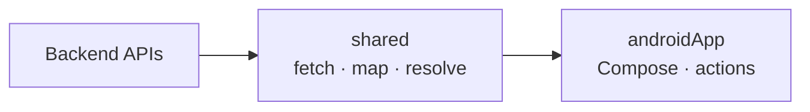

# Dynamic UI Renderer

A Kotlin Multiplatform project that renders native Android UI from backend JSON.

The **shared** module fetches layout templates and screen content, resolves bindings and styles, and produces a platform-agnostic `UiNode` tree. The **androidApp** module maps that tree to Jetpack Compose and handles user actions such as navigation and toasts.

```text
Backend JSON  →  shared (resolve)  →  UiNode tree  →  androidApp (Compose)
```

---

## Motivation

Traditional mobile screens hard-code layout and copy in the client. Every UI change requires an app release.

This project explores a **backend-driven UI** approach:

- The server owns **structure** (layout templates) and **content** (feed data).
- The client owns **rendering** (native Compose widgets) and **action execution**.
- Layouts and content can change without shipping a new binary for every tweak.

The shared rendering pipeline is intentionally free of Compose so the same resolution logic can later target other platforms.

---

## Architecture Overview



| Layer | Responsibility |
|-------|----------------|
| **Backend** | Serves UI definitions and per-screen feed JSON |
| **shared** | Network, DTOs, domain use cases, registries, binding/style resolution → `List<UiNode>` |
| **androidApp** | Screens, ViewModels, `UiRenderer`, navigation, toasts |

**Public shared API:**

```kotlin
val renderer = DynamicUi.createRenderer()
val nodes: List<UiNode> = renderer.resolveScreen("home")
```

`RendererFactory` is internal. In the Android app, Hilt provides a singleton `DynamicUiRenderer` via `DynamicUi.createRenderer()`.

---

## Module Structure

### `shared` (KMP library)

Kotlin Multiplatform module with an Android library target. All rendering logic lives in `commonMain`. There is **no Compose** in this module.

| Package | Role |
|---------|------|
| `bootstrap/` | `DynamicUi`, `DynamicUiRenderer` (public); `RendererFactory` (internal) |
| `data/` | Ktor APIs, DTOs, mappers, repository implementations |
| `definition/` | Component templates (`Text`, `Image`, `Stack`, `Card`, `List`) |
| `domain/` | Models, repository interfaces, use cases, `UiValue` hierarchy |
| `model/` | Resolved output: `node/`, `style/`, `action/`, `common/` |
| `runtime/` | Layout/style registries, binding resolver, UI runtime resolver |

### `androidApp` (Android application)

| Package | Role |
|---------|------|
| `app/` | `DynamicUiApplication`, `MainActivity` |
| `di/` | Hilt module providing `DynamicUiRenderer` |
| `navigation/` | `AppNavGraph`, `Screen` routes (`home`, `details`) |
| `presentation/` | Home & Details screens + ViewModels, UI state/events |
| `renderer/` | `UiRenderer` and per-node Compose renderers |

**App id:** `com.dynamicui` · **minSdk:** 24 · **targetSdk / compileSdk:** 36

---

## Rendering Pipeline

```mermaid
sequenceDiagram
    participant VM as ViewModel
    participant R as DynamicUiRenderer
    participant Init as InitializeDefinitionsUseCase
    participant Resolve as ResolveScreenUseCase
    participant UI as UiRenderer

    VM->>R: resolveScreen("home")
    alt first call
        R->>Init: fetch /ui-definitions
        Init->>Init: register layouts & styles
    end
    R->>Resolve: fetch /feed/home
    Resolve->>Resolve: layout + bindings → UiNode trees
    R-->>VM: List&lt;UiNode&gt;
    VM->>UI: UiRenderer(nodes, onAction)
```

1. **Initialize (once per renderer instance)** — `GET …/ui-definitions` → map DTOs → cache layouts and styles in memory.
2. **Resolve screen** — `GET …/feed/{screenId}` → for each feed item, look up its layout, resolve bindings and styles into a `UiNode` tree. Items with unknown `layoutId` are skipped.
3. **Render** — `UiRenderer` pattern-matches nodes and draws Compose widgets.
4. **Actions** — taps emit `NavigateAction` / `ToastAction`; ViewModels turn those into navigation or system toasts.

---

## Features Currently Supported

### Components

| Type | Description |
|------|-------------|
| **Text** | Static `text` or binding-backed string |
| **Image** | Static `url` or binding-backed URL (Coil) |
| **Stack** | Vertical or horizontal container with children |
| **Card** | Grouped container with children |
| **List** | Bound list of objects; children act as a per-item template |

### Actions

| Action | Behavior in androidApp |
|--------|------------------------|
| **Navigate** | `navController.navigate(destination)` |
| **Toast** | Android `Toast` with message |

### Styles

Resolved `Style` supports: `width` / `height` (`fill`, `wrap`, or fixed dp), `padding` / `margin` (four-value insets), `spacing`, `backgroundColor`, `textColor`, `fontSize`, `fontWeight` (`normal`, `medium`, `semibold`, `bold`), `cornerRadius` (four corners), `alignment` (`start`, `center`, `end`).

### Bindings

Feed `data` maps to a typed `UiValue` hierarchy: string, number, boolean, object, list (of objects), and null. Text/image bindings resolve via flat key lookup; list components expand a `ListValue` of objects using child definitions as the item template.

### Screens

| Screen | `screenId` | Notes |
|--------|------------|-------|
| Home | `"home"` | Dynamic feed rendered in a `Scaffold` |
| Details | `"details"` | Same pipeline; top app bar with back |

### Networking

| Endpoint | Purpose |
|----------|---------|
| `GET /ui-definitions` | Layout templates and styles |
| `GET /feed/{screenId}` | Screen content |

**Emulator base URL:** `http://10.0.2.2:3000/mock/dynui`  
Cleartext HTTP is allowed for `10.0.2.2` and `localhost` via network security config.

---

## How to Run the Project

### Prerequisites

- Android Studio (recent stable) with JDK 17
- Android emulator or device (API 24+)
- A backend serving the contract below at `http://10.0.2.2:3000/mock/dynui` (from the emulator’s perspective)

### Build & install

```bash
./gradlew :androidApp:assembleDebug
```

Or open the project in Android Studio and run the **androidApp** configuration.

### Notes

- The app expects the mock API to be reachable; without it, screens show an error state after load fails.
- First `resolveScreen` call loads definitions; later calls reuse the in-memory registries for that renderer instance.

---

## Project Structure

```text
DynamicUiRenderer/
├── androidApp/                 # Android application (Compose + Hilt)
│   └── src/main/
│       ├── kotlin/com/dynamicui/
│       │   ├── app/
│       │   ├── di/
│       │   ├── navigation/
│       │   ├── presentation/
│       │   └── renderer/
│       ├── res/
│       └── AndroidManifest.xml
├── shared/                     # KMP shared library
│   └── src/commonMain/kotlin/com/dynamicui/shared/
│       ├── bootstrap/
│       ├── data/
│       ├── definition/
│       ├── domain/
│       ├── model/
│       └── runtime/
├── gradle/
│   └── libs.versions.toml
├── build.gradle.kts
├── settings.gradle.kts
└── README.md
```

---

## Sample JSON Snippets

### Definitions (`GET /ui-definitions`)

```json
{
  "layouts": [
    {
      "id": "pokemon_card_layout",
      "root": {
        "type": "card",
        "id": "pokemon_card",
        "styleId": "card_container",
        "action": {
          "type": "navigate",
          "destination": "details",
          "params": { "id": "6" }
        },
        "children": [
          {
            "type": "text",
            "id": "pokemon_name",
            "styleId": "card_title",
            "binding": "name"
          },
          {
            "type": "image",
            "id": "pokemon_image",
            "binding": "imageUrl"
          }
        ]
      }
    }
  ],
  "styles": [
    {
      "id": "card_container",
      "width": "fill",
      "backgroundColor": "#FFFFFF",
      "padding": "16,16,16,16",
      "cornerRadius": "12,12,12,12"
    },
    {
      "id": "card_title",
      "textColor": "#212121",
      "fontSize": 18,
      "fontWeight": "bold",
      "padding": "8,8,8,8",
      "alignment": "start"
    }
  ]
}
```

### Feed (`GET /feed/home`)

```json
{
  "items": [
    {
      "id": "charizard",
      "layoutId": "pokemon_card_layout",
      "data": {
        "name": "Charizard",
        "imageUrl": "https://raw.githubusercontent.com/PokeAPI/sprites/master/sprites/pokemon/6.png"
      }
    }
  ]
}
```

### List component (bound collection)

```json
{
  "type": "list",
  "id": "moves_list",
  "orientation": "vertical",
  "binding": "moves",
  "children": [
    {
      "type": "text",
      "id": "move_name",
      "binding": "name"
    }
  ]
}
```

With feed data shaped as:

```json
{
  "moves": [
    { "name": "Flamethrower" },
    { "name": "Fly" }
  ]
}
```

Polymorphic JSON uses a `"type"` discriminator for components (`text`, `image`, `stack`, `card`, `list`) and actions (`navigate`, `toast`).

---

## Screenshots

> Placeholders — replace with real captures when available.

| Home | Details |
|------|---------|
|  |  |

---

## Roadmap

### V1 (current)

- [x] Shared resolution pipeline (`DynamicUiRenderer.resolveScreen`)
- [x] Definitions + feed APIs with in-memory layout/style registries
- [x] Components: Text, Image, Stack, Card, List
- [x] Actions: Navigate, Toast (executed in androidApp)
- [x] Style resolution (dimensions, insets, typography, alignment, colors)
- [x] Android Compose renderer (`UiRenderer`) for all supported nodes
- [x] Home (`home`) and Details (`details`) screens via Navigation Compose + Hilt

### V2

- [ ] Additional components (e.g. Button)
- [ ] Stronger offline / caching story for definitions and feed
- [ ] Definition invalidation when backend versions change
- [ ] Broader automated test coverage for mappers and resolvers

### Future Improvements

- [ ] iOS (or other) native renderer consuming the same `shared` module
- [ ] Animations / transitions on dynamic nodes
- [ ] Richer binding paths (nested key traversal beyond flat lookup)
- [ ] Proper multiplatform HTTP engine abstraction (`expect`/`actual`)

---

## Technologies Used

| Area | Stack |
|------|--------|
| Language | Kotlin 2.2 |
| Shared networking | Ktor Client 3, kotlinx.serialization |
| Android UI | Jetpack Compose, Material 3 |
| Architecture (Android) | ViewModel, Navigation Compose, Hilt |
| Images | Coil 3 |
| Build | Gradle, Android Gradle Plugin 8.13, KSP |
| Platform | Android (minSdk 24); shared module is KMP-shaped with an Android library target |

---

## License

No license file is included in this repository yet. Rights are reserved by the author unless a `LICENSE` is added.

---

*Built as a backend-driven UI experiment on Kotlin Multiplatform + Jetpack Compose.*
