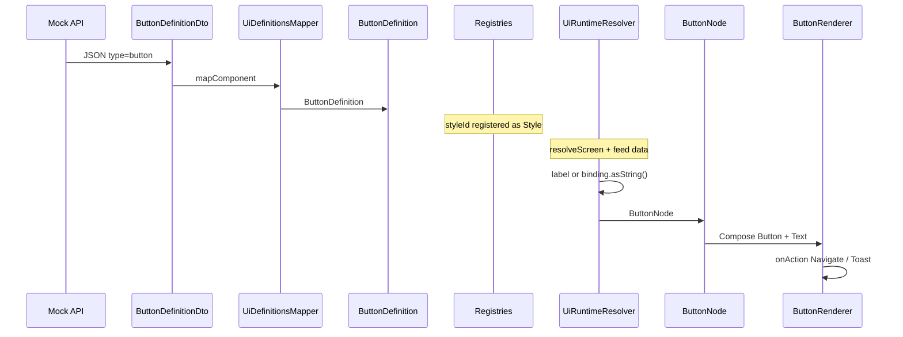

# Adding a New Component

Contributor guide for extending the renderer with a new UI component type.

This walkthrough uses **Button** as the example: a leaf control with a label (static or bound) and an optional tap action. Copy the same layering for any new type.

```text
DTO
  ↓
Definition
  ↓
Mapper (+ SerializationModule)
  ↓
Runtime Resolver
  ↓
UiNode
  ↓
Compose Renderer (+ UiRenderer dispatch)
  ↓
JSON (contract)
  ↓
Styles (optional style ids)
  ↓
Mock backend payloads
```

Touch **one layer at a time**. Do not skip serialization registration or the `UiRenderer` `when` branch.

---

## Checklist

Use this as a PR self-review list:

- [ ] Document the JSON `type` and fields (this guide + any contract notes you keep)
- [ ] Add `*DefinitionDto` with `@SerialName("…")`
- [ ] Register subclass in `SerializationModule` (`dynamicUiModule`)
- [ ] Add `*Definition` implementing `ComponentDefinition`
- [ ] Map DTO → definition in `UiDefinitionsMapperImpl.mapComponent`
- [ ] Add `*Node` implementing `UiNode` under `model/node`
- [ ] Resolve definition → node in `UiRuntimeResolverImpl`
- [ ] Add Compose `*Renderer` and dispatch in `UiRenderer`
- [ ] Wire styles the renderer will actually read
- [ ] Update mock `/ui-definitions` (and feed if needed) to exercise the type
- [ ] Smoke-test on emulator: deserialize → resolve → draw → action

There are **no automated tests** in the repo today; manual verification against the mock API is required.

---

## Architecture Reminder

| Layer | Module | Owns |
|-------|--------|------|
| DTO + mapper + serialization | `shared` / data | Wire format |
| Definition | `shared` / definition | Unresolved template |
| Runtime resolve | `shared` / runtime | Bindings + styles → node |
| UiNode | `shared` / model/node | Host contract |
| Renderer | `androidApp` | Compose |
| JSON / mock | Backend | Authoring |

`shared` must not import Compose. Android must not deserialize component DTOs.

---

## Step 1 — Decide the JSON shape

Define the backend contract before coding.

**Button goals:**

- Discriminator: `"type": "button"`
- Optional static `label` or `binding` (same priority pattern as text)
- Standard base fields: `id`, `styleId`, `action`

```json
{
  "type": "button",
  "id": "cta",
  "styleId": "primary_button",
  "label": "View details",
  "binding": null,
  "action": {
    "type": "navigate",
    "destination": "details"
  }
}
```

Bound label:

```json
{
  "type": "button",
  "id": "cta",
  "styleId": "primary_button",
  "binding": "buttonLabel",
  "action": {
    "type": "toast",
    "message": "Clicked"
  }
}
```

**Rules:**

- Primitives only in JSON (`String`, `Int`, …)  
- `"type"` must match `@SerialName`  
- Prefer the same static-vs-binding pattern as `text` / `image`  

---

## Step 2 — DTO

**Create:** `shared/.../data/dto/definitions/ButtonDefinitionDto.kt`

```kotlin
@Serializable
@SerialName("button")
data class ButtonDefinitionDto(
    override val id: String,
    override val styleId: String? = null,
    override val action: UiActionDto? = null,
    val label: String? = null,
    val binding: String? = null,
) : ComponentDefinitionDto
```

**Pattern to copy:** `TextDefinitionDto`.

| Rule | Why |
|------|-----|
| Implement `ComponentDefinitionDto` | Shared `id` / `styleId` / `action` |
| `@SerialName("button")` | Must match JSON `"type"` |
| `String?` for ids/bindings | No value objects in DTOs |

---

## Step 3 — Serialization registration

**Edit:** `shared/.../data/network/SerializationModule.kt`

```kotlin
polymorphic(ComponentDefinitionDto::class) {
    subclass(TextDefinitionDto::class)
    subclass(ImageDefinitionDto::class)
    subclass(StackDefinitionDto::class)
    subclass(CardDefinitionDto::class)
    subclass(ListDefinitionDto::class)
    subclass(ButtonDefinitionDto::class) // ← add
}
```

Skipping this step causes polymorphic decode failures when the mock returns `"type": "button"`.

---

## Step 4 — Definition

**Create:** `shared/.../definition/ButtonDefinition.kt`

```kotlin
data class ButtonDefinition(
    override val id: ComponentId,
    override val styleId: StyleId? = null,
    override val action: UiAction? = null,
    val label: String? = null,
    val binding: BindingKey? = null,
) : ComponentDefinition
```

**Pattern to copy:** `TextDefinition`.

This type is still **unresolved**: it may hold a `BindingKey` and `StyleId`, not final label text or a concrete `Style`.

---

## Step 5 — Mapper

**Edit:** `shared/.../data/mapper/UiDefinitionsMapperImpl.kt`  
Add a branch inside `mapComponent`:

```kotlin
is ButtonDefinitionDto -> ButtonDefinition(
    id = ComponentId(dto.id),
    styleId = dto.styleId?.let(::StyleId),
    action = ActionMapper.map(dto.action),
    label = dto.label,
    binding = dto.binding?.let(::BindingKey),
)
```

**Pattern to copy:** `TextDefinitionDto` branch.

Mappers only convert. No registry lookups, no network.

---

## Step 6 — UiNode

**Create:** `shared/.../model/node/ButtonNode.kt`

```kotlin
data class ButtonNode(
    override val id: ComponentId,
    override val style: Style?,
    override val action: UiAction?,
    val label: String,
) : UiNode
```

**Pattern to copy:** `TextNode`.

Runtime nodes are **resolved**: `label: String`, `style: Style?` — never `BindingKey` / `StyleId`.

---

## Step 7 — Runtime resolver

**Edit:** `shared/.../runtime/resolver/UiRuntimeResolverImpl.kt`

### 7a — Dispatch

In `resolveComponent`:

```kotlin
is ButtonDefinition ->
    resolveButton(component, context)
```

### 7b — Resolve function

```kotlin
private fun resolveButton(
    definition: ButtonDefinition,
    context: BindingContext
): ButtonNode {
    val resolvedLabel =
        definition.label
            ?: resolveBinding(definition.binding, context)?.asString()
            ?: ""

    return ButtonNode(
        id = definition.id,
        style = resolveStyle(definition.styleId),
        action = definition.action,
        label = resolvedLabel,
    )
}
```

**Pattern to copy:** `resolveText`.

| Concern | Helper |
|---------|--------|
| Binding | `resolveBinding` → `BindingResolver` |
| Style | `resolveStyle` → `StyleRegistry` |
| Action | Pass through |
| Children | N/A for Button (leaf) |

For a **container** component, also call `resolveChildren` like `Card` / `Stack`.

---

## Step 8 — Compose renderer

### 8a — Create renderer

**Create:** `androidApp/.../renderer/components/ButtonRenderer.kt`

```kotlin
@Composable
fun ButtonRenderer(
    node: ButtonNode,
    modifier: Modifier = Modifier,
    onAction: (UiAction) -> Unit,
) {
    val mappedModifier = ModifierMapper
        .map(style = node.style, modifier = modifier)
        .clickableAction(node.action, onAction)

    Button(
        onClick = { node.action?.let(onAction) },
        modifier = mappedModifier,
        colors = ButtonDefaults.buttonColors(
            containerColor = ColorMapper.map(node.style?.backgroundColor)
                ?: MaterialTheme.colorScheme.primary
        ),
        shape = ShapeMapper.map(node.style?.cornerRadius),
    ) {
        Text(
            text = node.label,
            style = TextStyleMapper.map(node.style),
        )
    }
}
```

Adjust Material APIs to match project style; keep these rules:

- Use existing mappers (`ModifierMapper`, `ColorMapper`, `ShapeMapper`, `TextStyleMapper`)  
- Forward `onAction` for `NavigateAction` / `ToastAction`  
- Do not call `DynamicUiRenderer` from the composable  

### 8b — Dispatch in `UiRenderer`

**Edit:** `androidApp/.../renderer/UiRenderer.kt`

```kotlin
is ButtonNode ->
    ButtonRenderer(
        node = node,
        modifier = modifier,
        onAction = onAction,
    )
```

Without this branch, resolution can succeed but the UI will not compile (non-exhaustive `when`) or will not draw the node.

---

## Step 9 — Styles

Buttons typically need a style id in definitions.

Example style for the mock / definitions payload:

```json
{
  "id": "primary_button",
  "width": "wrap",
  "height": "wrap",
  "padding": "12,24,12,24",
  "backgroundColor": "#1565C0",
  "textColor": "#FFFFFF",
  "fontSize": 16,
  "fontWeight": "medium",
  "cornerRadius": "8,8,8,8",
  "alignment": "center"
}
```

| Style field | Likely Button use |
|-------------|-------------------|
| `width` / `height` / `margin` | `ModifierMapper` |
| `backgroundColor` | Button container color |
| `cornerRadius` | Button shape |
| `textColor` / `fontSize` / `fontWeight` | Label `TextStyle` |
| `padding` | Only if you apply it in `ButtonRenderer` |

Only fields your renderer reads matter. See [styles.md](./styles.md) and [components.md](./components.md).

Wire the component with `"styleId": "primary_button"`.

---

## Step 10 — JSON in layouts

Embed the button inside an existing layout root (often a `card` or `stack`):

```json
{
  "id": "action_card",
  "root": {
    "type": "card",
    "id": "card",
    "styleId": "card_container",
    "children": [
      {
        "type": "text",
        "id": "title",
        "binding": "title"
      },
      {
        "type": "button",
        "id": "cta",
        "styleId": "primary_button",
        "binding": "buttonLabel",
        "action": {
          "type": "navigate",
          "destination": "details"
        }
      }
    ]
  }
}
```

Feed item:

```json
{
  "id": "item_1",
  "layoutId": "action_card",
  "data": {
    "title": "Charizard",
    "buttonLabel": "View details"
  }
}
```

---

## Step 11 — Mock backend

The app loads definitions and feed from:

```text
http://10.0.2.2:3000/mock/dynui/ui-definitions
http://10.0.2.2:3000/mock/dynui/feed/{screenId}
```

There is **no mock server inside this repository**. Update whichever service (or local mock) serves those paths:

1. Add `"primary_button"` (or your style) under `styles`  
2. Add or extend a layout that includes `"type": "button"`  
3. Ensure the feed for `home` / `details` references that `layoutId` and supplies binding keys  
4. Restart the mock if required, then cold-start the app (definitions load once per `DynamicUiRenderer` instance)

If the mock still returns only old component types, the new code path will never run.

---

## End-to-End Data Flow (Button)



---

## Layer Map (what to touch)

| # | Layer | Location | Action |
|---|-------|----------|--------|
| 1 | Contract / docs | `docs/` (optional) | Describe `type` + fields |
| 2 | DTO | `shared/.../data/dto/definitions/` | Create `ButtonDefinitionDto` |
| 3 | Serialization | `SerializationModule.kt` | `subclass(ButtonDefinitionDto)` |
| 4 | Definition | `shared/.../definition/` | Create `ButtonDefinition` |
| 5 | Mapper | `UiDefinitionsMapperImpl.kt` | `when` branch |
| 6 | UiNode | `shared/.../model/node/` | Create `ButtonNode` |
| 7 | Resolver | `UiRuntimeResolverImpl.kt` | `when` + `resolveButton` |
| 8 | Renderer | `androidApp/.../renderer/components/` | Create `ButtonRenderer` |
| 9 | Dispatch | `UiRenderer.kt` | `is ButtonNode` |
| 10 | Styles | Mock `styles` array | Add style object(s) |
| 11 | JSON layouts | Mock `layouts` | Use `"type": "button"` |
| 12 | Feed | Mock `feed/{screenId}` | Bindings + optional item actions |

You do **not** need to change: `DynamicUi` / `DynamicUiRenderer` façade, Hilt module, or NavGraph — unless the button navigates to a **new** route that does not exist yet (see [navigation.md](./navigation.md)).

---

## Rules (do not break)

| Rule | Detail |
|------|--------|
| DTOs use primitives | Never `ComponentId` / `BindingKey` on DTOs |
| Definitions use value objects | Ids and bindings are typed |
| Nodes are resolved | `Style?` and concrete content strings |
| Register polymorphism | Every new DTO needs `subclass(...)` |
| Exhaustive `when`s | Mapper, resolver, and `UiRenderer` |
| No Compose in `shared` | Drawing stays in `androidApp` |
| Actions stay declarative | Shared attaches `UiAction`; screens execute via `UiEvent` |

---

## Suggested Manual Test Plan

1. Mock returns a layout containing a button; app starts without crash.  
2. Static `label` appears correctly.  
3. `binding` fills label from feed; missing key shows `""`.  
4. `styleId` affects colors / shape / typography as implemented.  
5. Tap with `navigate` opens a registered route (e.g. `details`).  
6. Tap with `toast` shows a toast.  
7. Button nested under `card` / `stack` still receives clicks as expected.

---

## Related Docs

| Doc | Use when |
|-----|----------|
| [components.md](./components.md) | See how existing renderers apply styles/actions |
| [styles.md](./styles.md) | Style string formats and mappers |
| [bindings.md](./bindings.md) | Binding / list context rules |
| [runtime.md](./runtime.md) | Why resolve exists |
| [rendering_pipeline.md](./rendering_pipeline.md) | Full pipeline context |
| [navigation.md](./navigation.md) | If the action targets a new screen |

---

*Follow this guide in order. A component is “done” only when mock JSON round-trips through shared resolve and is visible — and tappable — in Compose.*
