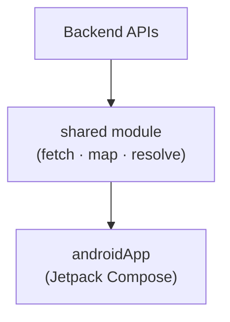
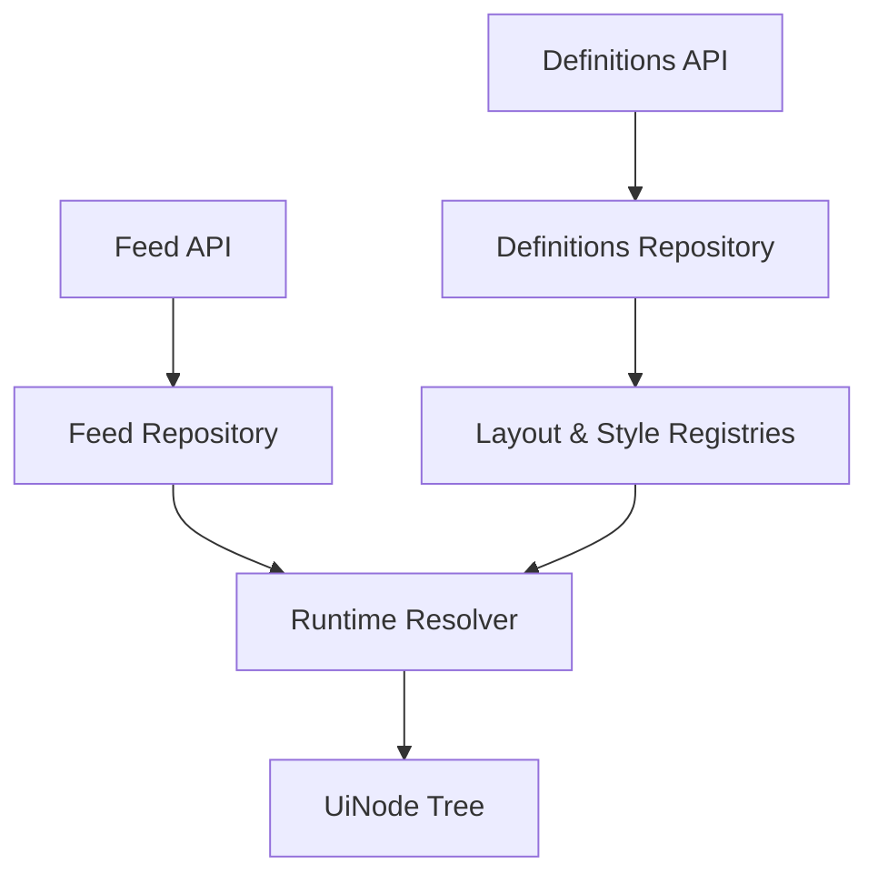

# Dynamic UI Renderer

**Dynamic UI Renderer** is a Kotlin Multiplatform project that renders UI from backend JSON instead of hard-coded screens.

A server sends layout templates and screen content. The **shared** module fetches that data, resolves bindings, and produces a **`UiNode` tree** — a platform-agnostic description of what to display. The **androidApp** module is the native Android shell built with Jetpack Compose.

This approach lets teams update layouts and content without shipping a new app version for every UI change.

---

## Project Goals

- **Backend-controlled UI** — layouts and content driven by remote JSON
- **Shared renderer logic** — fetch, map, resolve, and cache in the KMP `shared` module
- **Native Android UI** — Jetpack Compose in `androidApp` for platform rendering
- **Kotlin Multiplatform business logic** — rendering pipeline lives in `commonMain`
- **Clean Architecture** — strict layers with clear dependency direction

---

## High Level Architecture



The backend owns UI structure and data. Shared turns that into `UiNode` trees. Android is responsible for drawing them on screen.

---

## Project Structure

```text
DynamicUiRenderer/
├── shared/          # KMP rendering engine
│   ├── data/        # Network, DTOs, mappers, repository implementations
│   ├── domain/      # Models, repository interfaces, use cases, value objects
│   ├── definition/  # Component templates (text, image, stack, card, list)
│   ├── runtime/     # Registries, binding resolver, runtime resolver
│   ├── model/       # Resolved UiNode tree + Orientation
│   ├── style/       # Resolved style properties
│   └── factory/     # RendererFactory and Renderer (public API)
│
└── androidApp/      # Android app — Compose UI, Dagger Hilt
```

| Folder | What it does |
|--------|--------------|
| `data/` | Talks to the backend, deserializes JSON, maps DTOs to domain types |
| `domain/` | Business rules — use cases, domain models, repository contracts |
| `definition/` | Reusable layout templates fetched from the server |
| `runtime/` | Caches definitions, resolves bindings and styles into nodes |
| `model/` | Output types — the resolved `UiNode` tree ready for display |
| `style/` | Visual properties (colors, padding, corner radius, etc.) |
| `factory/` | Wires everything together; exposes `Renderer` |
| `androidApp/` | Android presentation layer (Compose + Hilt) |

---

## Data Flow

When you call `renderer.resolveScreen("home")`, this is what happens:



**Initialization (first call only)**

1. Fetch UI definitions from `/ui-definitions`
2. Map JSON → domain models
3. Store layouts and styles in in-memory registries

**Screen resolution (every call)**

1. Fetch feed data from `/feed/{screenId}`
2. For each feed item, look up its layout in the registry
3. Resolve bindings (dynamic text/URLs) and styles
4. Return a `List<UiNode>` — one tree root per feed item

---

## Core Concepts

### Definitions

Reusable layout templates from the backend. A definition describes **structure** — which components exist, how they nest, and which styles or bindings they use. Definitions are fetched once and cached in registries.

### Feed

Screen-specific **content** from the backend. Each feed item references a layout by ID and provides binding data (dynamic values like names, URLs, or prices). Feed data is fetched per screen.

### Bindings

A link between a component and a value in feed data. For example, a `TextDefinition` with `binding: "pokemon_name"` reads that key from the feed item's data map and displays the resolved string.

### Runtime Nodes

The **output** of rendering. After bindings and styles are resolved, the engine produces a `UiNode` tree (`TextNode`, `ImageNode`, `StackNode`, `CardNode`, `ListNode`). These are fully resolved — no raw IDs or unresolved bindings remain.

### Registries

In-memory caches for definitions.

| Registry | Stores |
|----------|--------|
| `LayoutRegistry` | `Map<LayoutId, LayoutDefinition>` |
| `StyleRegistry` | `Map<StyleId, Style>` |

Populated during initialization, read during screen resolution.

### Renderer

The single entry point for the shared module. Call `resolveScreen(screenId)` and get back `List<UiNode>`. Definition loading happens automatically on the first call — callers never manage initialization themselves.

---

## Public API

Android (or any consumer) should only interact with the renderer through:

```kotlin
val renderer = RendererFactory().create()
val nodes: List<UiNode> = renderer.resolveScreen("home")
```

- **`RendererFactory`** — builds the dependency graph (network, repos, registries, use cases)
- **`Renderer`** — hides initialization and use cases behind one method
- **`screenId`** — a plain `String` (e.g. `"home"`), because screen IDs are backend-owned

Everything else — APIs, mappers, registries, resolvers — is internal to `shared`.

---

## Why This Architecture?

| Decision | Reason |
|----------|--------|
| **DTO separation** | JSON types stay in `data/`. Domain and runtime never see raw DTOs. |
| **Runtime models (`UiNode`)** | Definitions hold unresolved IDs; nodes hold resolved values ready for UI. |
| **Registries** | Definitions change rarely — fetch once, cache in memory, reuse across screens. |
| **Value objects** | `ComponentId`, `LayoutId`, `StyleId`, `BindingKey` prevent mixing up identifiers. |
| **`String` for screen IDs** | Screens are backend-driven; no client recompile when new screens are added. |
| **Renderer as public API** | One method, one responsibility — consumers don't touch use cases or networking. |
| **Two use cases** | `InitializeDefinitionsUseCase` (load templates) and `ResolveScreenUseCase` (render a screen). |
| **Shared has no Compose** | Rendering logic is platform-agnostic; only `androidApp` knows about Compose. |
| **Hilt in Android only** | DI is a platform concern; the shared module stays framework-free. |

---

## Design Principles

- **Single Responsibility** — each package does one job (fetch, map, resolve, or display).
- **Separation of Concerns** — structure (definitions) is separate from content (feed) and output (nodes).
- **Backend Driven UI** — the server controls what the user sees without an app release.
- **Clean Architecture** — dependencies point inward; domain never depends on data or runtime details.
- **Dependency Inversion** — use cases depend on repository interfaces, not HTTP implementations.

---

## Current Scope

### Supported component types

| Type | Description |
|------|-------------|
| **Text** | Static text or binding-backed dynamic text |
| **Image** | Static URL or binding-backed dynamic URL |
| **Stack** | Vertical or horizontal container |
| **Card** | Grouped container with children |
| **List** | Scrollable list container |

### Supported actions

Actions are attached to nodes during resolution. The shared module carries them; execution is a platform concern.

| Action | Payload |
|--------|---------|
| **Navigate** | `destination: String`, optional `params` |
| **Toast** | `message: String` |

### Supported binding value types

`String`, `Number`, `Boolean`, nested `Object`, `List`, and `Null` — mapped to the `UiValue` hierarchy.

### API endpoints

| Endpoint | Purpose |
|----------|---------|
| `GET /ui-definitions` | Layout templates and styles |
| `GET /feed/{screenId}` | Screen content |

---

## Related Documentation

| Document | Contents |
|----------|----------|
| [renderer-flow.md](./renderer-flow.md) | Detailed step-by-step rendering pipeline |
| [backend-contract.md](./backend-contract.md) | JSON schemas and API contract |
| [v1-decisions.md](./v1-decisions.md) | Key architectural decisions |
| [roadmap.md](./roadmap.md) | Future improvements |

---

*This document reflects the current codebase. For a deeper dive into any layer, see the related docs above.*
