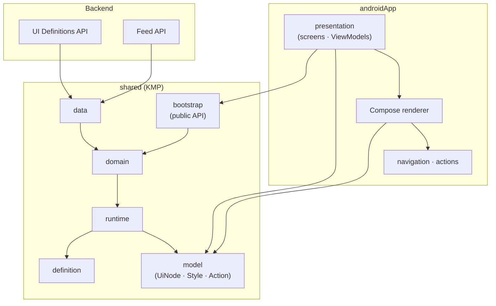
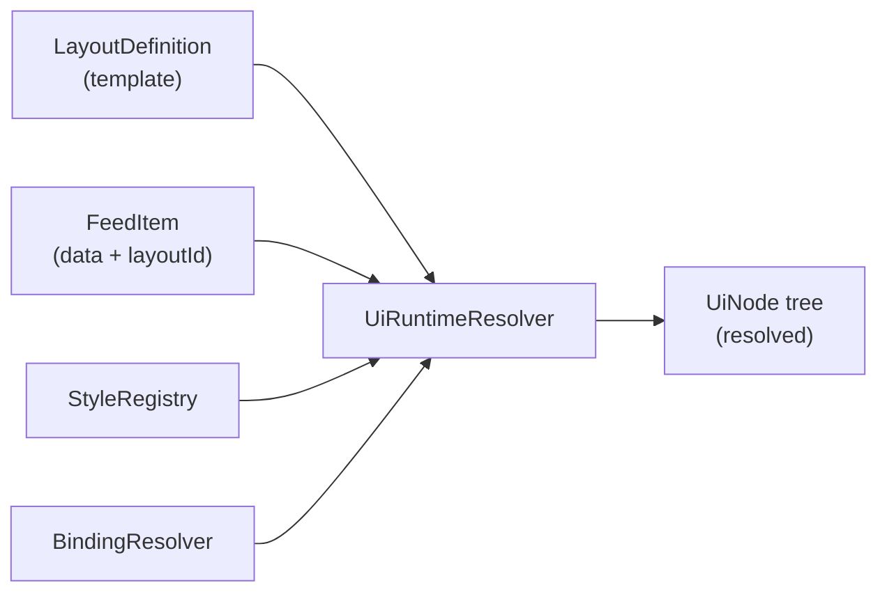
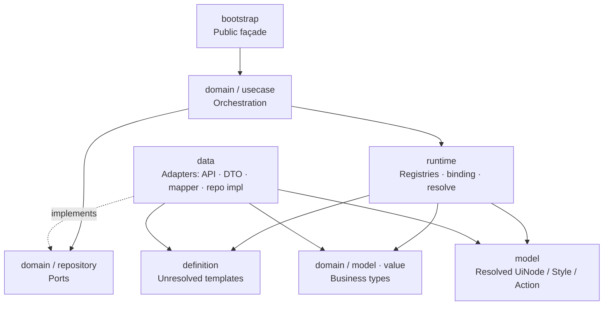
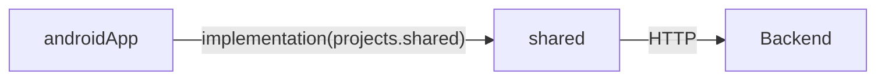
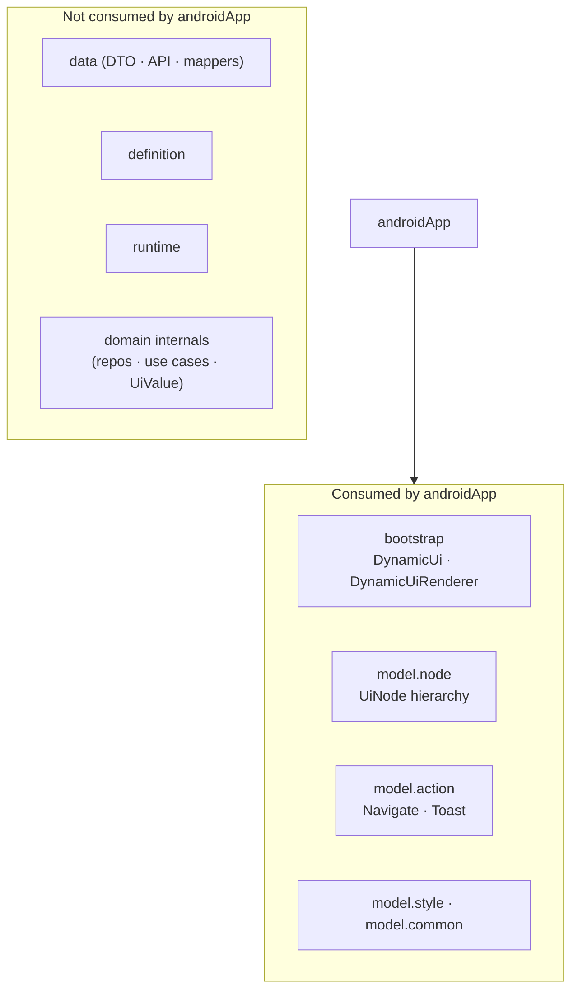
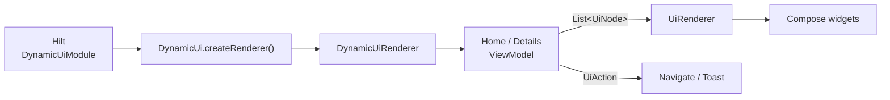

# Architecture

Architectural decisions behind Dynamic UI Renderer — how the system is layered, why each layer exists, and how Android consumes the shared engine.

This document explains **structure and intent**, not individual source files.

---

## Overall Architecture

The system is a **backend-driven UI pipeline** split across two Gradle modules:

| Module | Role |
|--------|------|
| **shared** | Fetch, map, cache, and resolve remote UI into a platform-agnostic `UiNode` tree |
| **androidApp** | Host the app shell, map `UiNode` → Jetpack Compose, execute actions |



**Core idea:** the backend owns *what* to show; **shared** decides *what the resolved tree looks like*; **androidApp** decides *how it looks and behaves on Android*.

---

## Why the Shared Module Exists

The shared module exists to keep **UI resolution logic out of the Android presentation layer**.

Without it, every screen ViewModel would eventually own networking, JSON mapping, template lookup, binding rules, and Compose-specific concerns in one place. That collapses three different jobs into the UI layer:

1. Talking to the backend  
2. Interpreting templates + data  
3. Drawing widgets  

`shared` isolates jobs (1) and (2).

### Design goals

| Goal | How shared supports it |
|------|------------------------|
| **Reuse** | Resolution can later be consumed by iOS/other hosts without rewriting the pipeline |
| **Testability** | Domain and runtime logic can be reasoned about without Compose or Activities |
| **Stability of contract** | Android depends on `UiNode` / `UiAction` / `Style`, not on DTOs or HTTP |
| **Release independence** | Layout/content changes stay on the server; client ships renderers for known node types |

### What shared deliberately does *not* do

- It does **not** import Compose or Android UI APIs.
- It does **not** execute navigation or show toasts.
- It does **not** expose DTOs, Ktor clients, or mappers as its public surface.

The only intentional entry points for consumers are `DynamicUi` / `DynamicUiRenderer` and the resolved **model** types (`UiNode`, `Style`, `UiAction`, etc.).

---

## Why the Runtime Resolver Exists

Definitions and feed data are **not** ready for UI.

| Input | Nature |
|-------|--------|
| **Definitions** | Templates with unresolved `styleId`, optional `binding` keys, nested component trees |
| **Feed items** | Content maps + a `layoutId` pointing at a template |

The **runtime resolver** is the engine that combines those inputs into a fully resolved tree:



### Why this is a separate concern

If mapping and rendering were merged, every change to binding rules or list expansion would touch both networking and Compose. The resolver exists so that:

1. **Templates stay reusable** — one layout serves many feed items.
2. **IDs stay unresolved until needed** — styles are looked up from registries at resolve time, not baked into DTOs.
3. **Bindings are evaluated once** — text/image values and list item contexts are computed into concrete node fields.
4. **Android receives a finished tree** — no `styleId`, no raw binding keys, no “look this up yourself” leftovers on leaf content.

In short: **definitions describe structure; the runtime resolver produces display state.**

---

## Responsibilities of Every Layer

### Inside `shared`



| Layer | Responsibility | Does not |
|-------|----------------|----------|
| **bootstrap** | Wire the graph once; expose `resolveScreen`; lazy-init definitions | Know Compose or navigation |
| **domain** | Use cases, repository *interfaces*, domain models, typed values (`UiValue`, ids) | Call HTTP or serialize JSON |
| **definition** | Shape of backend templates (still unresolved) | Resolve bindings or styles |
| **runtime** | Cache layouts/styles; resolve bindings; walk definition trees into `UiNode`s | Fetch over the network |
| **model** | Resolved output contract for any UI host | Know how Compose draws |
| **data** | HTTP, polymorphic JSON, DTO→domain/definition mapping, repository *implementations* | Leak into Android or into use-case signatures as DTOs |

### Inside `androidApp`

| Layer | Responsibility |
|-------|----------------|
| **presentation** | Screens and ViewModels: call `resolveScreen`, hold UI state, map actions to `UiEvent` |
| **renderer** | Map `UiNode` subtypes to Composables; map `Style` to Modifiers / text styles |
| **navigation** | Route graph (`home`, `details`) |
| **di** | Provide a singleton `DynamicUiRenderer` from `DynamicUi.createRenderer()` |

Android owns **pixels and side effects**. Shared owns **meaning of the remote UI contract**.

---

## Clean Architecture Decisions

The shared module follows Clean Architecture / hexagonal ideas, adapted for a renderer rather than a CRUD app.

### 1. Dependency rule (inward / toward abstractions)

- Use cases depend on **repository interfaces**, not Ktor.
- Use cases depend on **runtime abstractions** (`LayoutRegistry`, `UiRuntimeResolver`), not concrete HTTP.
- DTOs live only in **data**; they never appear in domain use-case APIs or in androidApp.

### 2. Separation of unresolved vs resolved models

| Kind | Example | When used |
|------|---------|-----------|
| Unresolved | `TextDefinition` with `styleId` + `binding` | After mapping definitions, before resolve |
| Resolved | `TextNode` with `style: Style?` + `text: String` | After runtime resolve; what Android renders |

This prevents the UI layer from re-implementing style lookup and binding rules.

### 3. Two use cases, one public method

| Use case | Job |
|----------|-----|
| `InitializeDefinitionsUseCase` | Load templates/styles into registries (once) |
| `ResolveScreenUseCase` | Load feed for a `screenId`, resolve each item |

`DynamicUiRenderer.resolveScreen` hides that split so callers never manage initialization order.

### 4. Registries as an explicit cache boundary

Layouts and styles change rarely compared to feed content. Caching them in memory after first load is an architectural choice: **definitions are infrastructure for many screens**, not payload for one request.

### 5. Actions are data until the platform layer

Shared attaches `UiAction` to nodes. It does not navigate or toast. That keeps shared free of Android `Context`, `NavController`, and UI toolkits — and keeps action policy in the app shell.

### 6. Value objects for identity

Ids and binding keys are typed (`LayoutId`, `StyleId`, `ComponentId`, `BindingKey`) so domain code cannot casually mix “this string is a layout” with “this string is a style.”

### 7. Frameworks stay at the edges

| Concern | Where it lives |
|---------|----------------|
| Ktor / serialization | `shared` data |
| Hilt / Compose / Navigation / Coil | `androidApp` only |

---

## Dependency Flow

### Module-level



`androidApp` depends on `shared`. `shared` never depends on `androidApp`.

### What Android is allowed to import from shared

In practice, androidApp depends on a **narrow surface**:



ViewModels talk to **`DynamicUiRenderer`**. Compose renderers talk to **`UiNode` / `Style` / `UiAction`**. They do not call repositories, mappers, or the runtime resolver directly.

### Internal shared flow (orchestration)

```mermaid
sequenceDiagram
    participant Host as androidApp
    participant API as DynamicUiRenderer
    participant Init as InitializeDefinitions
    participant Resolve as ResolveScreen
    participant Repo as Repository ports
    participant RT as Runtime

    Host->>API: resolveScreen(screenId)
    API->>Init: ensureInitialized()
    Init->>Repo: getDefinitions()
    Init->>RT: register layouts & styles
    API->>Resolve: invoke(screenId)
    Resolve->>Repo: getFeed(screenId)
    Resolve->>RT: resolve(layout, feedItem)
    RT-->>Host: List&lt;UiNode&gt;
```

Data adapters sit behind the repository ports; the host never sees them.

---

## How Android Depends on the Shared Renderer

### Wiring

1. Hilt installs a singleton provider that calls `DynamicUi.createRenderer()`.
2. Home / Details ViewModels inject `DynamicUiRenderer`.
3. On start, each ViewModel calls `resolveScreen("home")` or `resolveScreen("details")`.
4. Success state holds `List<UiNode>`; the screen passes that list to `UiRenderer`.



### Division of labor at the boundary

| Shared delivers | Android owns |
|-----------------|--------------|
| Ordered list of resolved node trees | Loading / error / success UI state |
| Concrete text, URLs, children, styles | Mapping style → Modifier / TextStyle |
| Optional `UiAction` on nodes | Interpreting navigate vs toast |
| Screen identity as a plain `String` | Route table (`home`, `details`) and back stack |

### Why this dependency shape matters

- Swapping Compose for another toolkit would not require changing the resolver.
- Adding a new backend field requires shared mapping/resolve first; Android only changes if a **new node type** or **new style property** must be drawn.
- The app cannot accidentally couple screens to JSON shape changes as long as the resolved model stays stable.

---

## Summary of Architectural Stance

1. **Two modules, one pipeline** — shared resolves; Android paints and acts.  
2. **Shared exists** so UI interpretation is reusable and UI-toolkit-free.  
3. **Runtime resolver exists** so templates + data become a finished `UiNode` tree before any widget code runs.  
4. **Layers separate** fetch/map, domain orchestration, unresolved templates, resolve/cache, and resolved models.  
5. **Clean Architecture** shows up as ports for repositories, inward dependencies, DTO isolation, and a thin public façade.  
6. **Android depends on the renderer** only through `DynamicUiRenderer` and the resolved model — not through data or definition internals.

---

*For a product-facing overview and run instructions, see [README.md](../README.md).*
