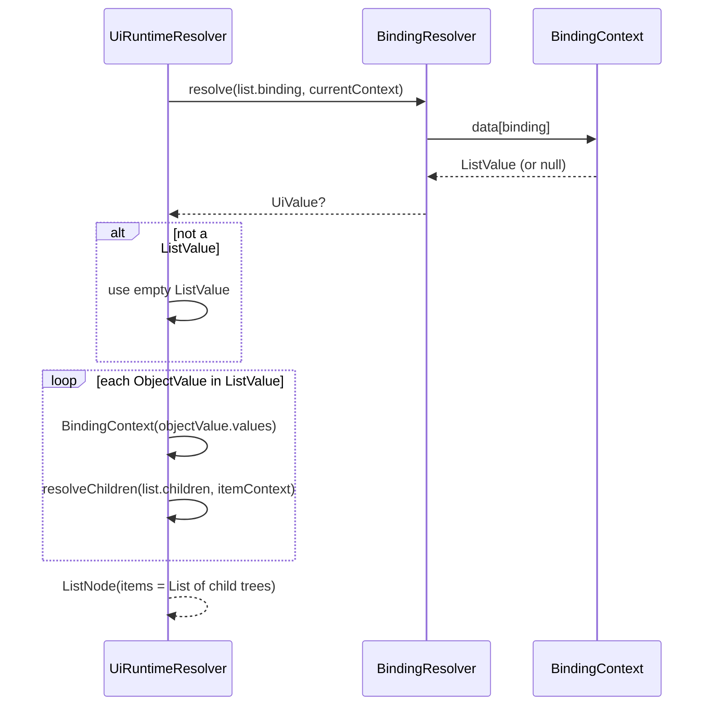
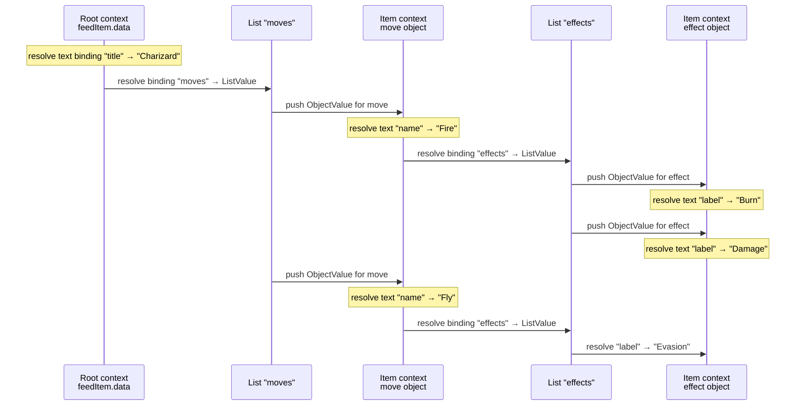
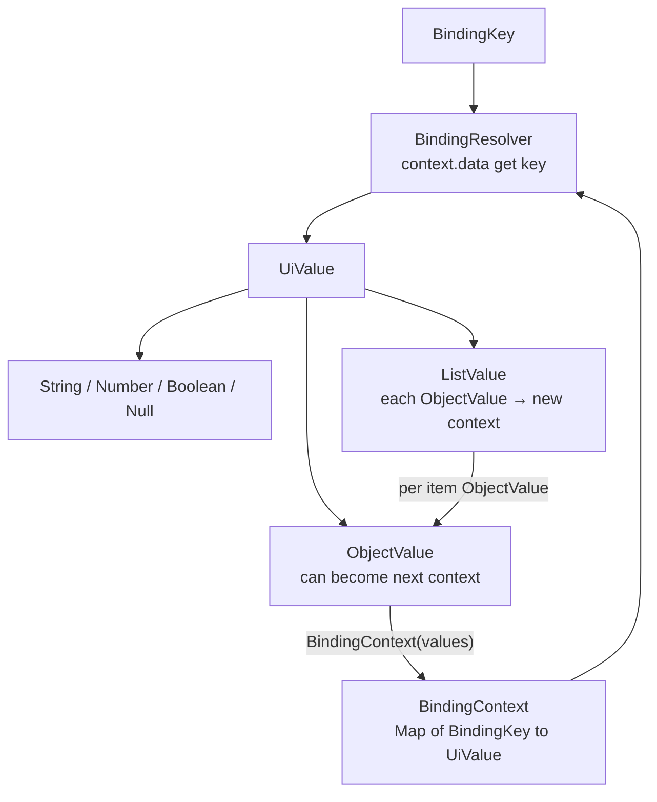

# Bindings

How dynamic values flow from feed data into resolved UI nodes.

Bindings are the link between **layout templates** (which declare *where* data should appear) and **feed item data** (which supplies the values). Resolution is intentionally simple: a flat key lookup inside a context map. Nested structures work by **swapping the context**, not by walking dotted paths.

```text
FeedItem.data
    → BindingContext
        → BindingResolver(BindingKey)
            → UiValue
                → Text / Image (.asString())
                → List (ListValue → new contexts per item)
```

---

## BindingKey

A typed wrapper around the string key used in feed `data` and in definition `binding` fields.

```kotlin
@JvmInline
value class BindingKey(
    val value: String
)
```

**Why it exists:** so domain and runtime code cannot casually mix “this string is a binding key” with layout ids, style ids, or free-form text.

**Where keys come from:**

| Source | Example |
|--------|---------|
| Feed JSON object keys | `"name"` → `BindingKey("name")` |
| Definition `binding` field | `"binding": "imageUrl"` → `BindingKey("imageUrl")` |
| Nested object keys | Inside an `ObjectValue`, each property is also a `BindingKey` |

Lookup is by **exact key equality**. There is no `"stats.hp"` path syntax — nested access happens only after the context is replaced with a nested object’s map (see lists below).

---

## UiValue Hierarchy

All bindable feed values are modeled as a sealed hierarchy:

```kotlin
sealed interface UiValue

data class StringValue(val value: String) : UiValue
data class NumberValue(val value: Double) : UiValue
data class BooleanValue(val value: Boolean) : UiValue
data class ObjectValue(val values: Map<BindingKey, UiValue>) : UiValue
data class ListValue(val values: List<ObjectValue>) : UiValue
data object NullValue : UiValue
```

### How JSON becomes UiValue

During feed mapping:

| JSON | UiValue |
|------|---------|
| `"Charizard"` | `StringValue` |
| `36` / `3.14` | `NumberValue` |
| `true` / `false` | `BooleanValue` |
| `null` | `NullValue` |
| `{ ... }` | `ObjectValue` (keys → `BindingKey`, values mapped recursively) |
| `[ {...}, {...} ]` | `ListValue` of **objects only** |
| `[ 1, "a" ]` | Non-object elements are **dropped**; may become an empty `ListValue` |

### Helpers

```kotlin
fun UiValue.asString(): String? =
    (this as? StringValue)?.value

fun UiValue.asNumber(): Double? =
    (this as? NumberValue)?.value

fun UiValue.asBoolean(): Boolean? =
    (this as? BooleanValue)?.value

fun UiValue.asObject(): Map<BindingKey, UiValue>? =
    (this as? ObjectValue)?.values

fun UiValue.asList(): List<UiValue>? =
    (this as? ListValue)?.values

fun UiValue.isNull(): Boolean =
    this is NullValue
```

Today, text and image resolution use **`.asString()`** only. Numbers/booleans in `data` are preserved in the map but are not auto-coerced into label text unless they were serialized as strings.

---

## ObjectValue

A nested map of bindings — the structured counterpart of a JSON object.

```kotlin
data class ObjectValue(
    val values: Map<BindingKey, UiValue>
) : UiValue
```

**Roles:**

1. **Feed item root data** is already `Map<BindingKey, UiValue>` (same shape as an object’s interior).
2. **Each row of a list** must be an `ObjectValue` — that row’s `values` become the next `BindingContext`.
3. **Nested objects** can hold further `ObjectValue` / `ListValue` / primitives for deeper list nesting.

`ObjectValue` is the unit of “scope” when the runtime pushes a new binding context.

---

## ListValue

An ordered collection of objects used by list components.

```kotlin
data class ListValue(
    val values: List<ObjectValue>
) : UiValue
```

**Constraints:**

- Elements are **`ObjectValue` only** (enforced at feed-map time and by the type itself).
- A list component’s binding must resolve to a `ListValue`; otherwise the resolver treats it as an **empty** list.

```kotlin
val listValue = resolveBinding(definition.binding, context) as? ListValue
    ?: ListValue(emptyList())
```

---

## BindingContext

The active scope for key lookup during resolution.

```kotlin
data class BindingContext(
    val data: Map<BindingKey, UiValue>
)
```

### How contexts are created

**Root context** — when resolving a layout against a feed item:

```kotlin
val context = BindingContext(
    data = feedItem.data
)
```

**Item context** — when expanding a list row:

```kotlin
val itemContext = BindingContext(
    data = objectValue.values
)
```

Everything resolved under that call uses `itemContext` until another nested list pushes a deeper context.

Contexts are **replaced**, not merged. Keys from the parent feed item are **not** visible inside a list item unless they also exist on that item object.

---

## BindingResolver

The lookup port and its implementation:

```kotlin
interface BindingResolver {
    fun resolve(
        binding: BindingKey?,
        context: BindingContext
    ): UiValue?
}

class BindingResolverImpl : BindingResolver {
    override fun resolve(
        binding: BindingKey?,
        context: BindingContext
    ): UiValue? {
        if (binding == null) return null
        return context.data[binding]
    }
}
```

| Input | Result |
|-------|--------|
| `binding == null` | `null` |
| Key missing in `context.data` | `null` |
| Key present | The `UiValue` at that key |

No network, no recursion, no path parsing — **map get** only.

---

## How Leaves Use Bindings

### Text

```kotlin
val resolvedText =
    definition.text
        ?: resolveBinding(definition.binding, context)?.asString()
        ?: ""
```

### Image

```kotlin
val resolvedUrl =
    definition.url
        ?: resolveBinding(definition.binding, context)?.asString()
        ?: ""
```

**Priority:** static field wins over binding; missing binding → empty string.

---

## How Lists Use Bindings



Conceptually:

```kotlin
private fun resolveList(
    definition: ListDefinition,
    context: BindingContext
): ListNode {
    val listValue = resolveBinding(definition.binding, context) as? ListValue
        ?: ListValue(emptyList())

    val items = listValue.values.map { objectValue ->
        val itemContext = BindingContext(data = objectValue.values)
        resolveChildren(
            children = definition.children,
            context = itemContext
        )
    }

    return ListNode(
        id = definition.id,
        orientation = definition.orientation,
        style = resolveStyle(definition.styleId),
        action = definition.action,
        items = items
    )
}
```

The list’s **children** are an **item template**. They are not rendered once against the parent context; they are resolved **once per object** in the list.

---

## Nested Lists

Nested lists do not need special path syntax. They work because:

1. A list item is an `ObjectValue`.
2. That object’s map becomes a new `BindingContext`.
3. A child `ListDefinition` inside the template looks up **its** `binding` in that new context.
4. If the value is another `ListValue`, the process repeats.

### Example JSON

Feed item `data`:

```json
{
  "title": "Charizard",
  "moves": [
    {
      "name": "Fire",
      "effects": [
        { "label": "Burn" },
        { "label": "Damage" }
      ]
    },
    {
      "name": "Fly",
      "effects": [
        { "label": "Evasion" }
      ]
    }
  ]
}
```

Mapped shape (simplified):

```text
FeedItem.data
├── BindingKey("title") → StringValue("Charizard")
└── BindingKey("moves") → ListValue
      ├── ObjectValue { name, effects → ListValue[...] }
      └── ObjectValue { name, effects → ListValue[...] }
```

Layout template (conceptual):

```json
{
  "type": "stack",
  "orientation": "vertical",
  "children": [
    { "type": "text", "binding": "title" },
    {
      "type": "list",
      "binding": "moves",
      "orientation": "vertical",
      "children": [
        { "type": "text", "binding": "name" },
        {
          "type": "list",
          "binding": "effects",
          "orientation": "vertical",
          "children": [
            { "type": "text", "binding": "label" }
          ]
        }
      ]
    }
  ]
}
```

### Resolution walk



### Resulting node shape

```text
StackNode
├── TextNode("Charizard")
└── ListNode  (binding was "moves")
      ├── [ TextNode("Fire"),
      │     ListNode (binding was "effects")
      │       ├── [ TextNode("Burn") ]
      │       └── [ TextNode("Damage") ] ]
      └── [ TextNode("Fly"),
            ListNode
              └── [ TextNode("Evasion") ] ]
```

Each nesting level:

| Level | Context `data` comes from |
|-------|---------------------------|
| Root | `FeedItem.data` |
| Move row | `ObjectValue` of one move |
| Effect row | `ObjectValue` of one effect |

At the effect level, `BindingKey("label")` resolves because it exists **on the effect object**, not because the resolver walked `"moves[].effects[].label"`.

---

## What Bindings Do *Not* Do

| Limitation | Behavior today |
|------------|----------------|
| Dotted paths (`"a.b.c"`) | Treated as a single literal key; will miss unless that exact key exists |
| Parent key fallback inside list items | Parent keys are invisible after context swap |
| Non-object list elements | Dropped when mapping feed JSON |
| Auto stringifying numbers/bools for Text | `.asString()` only succeeds on `StringValue` |
| Merging contexts | Always replace, never merge |

---

## Mental Model



1. **`BindingKey`** — which slot to read.  
2. **`BindingContext`** — which map is in scope.  
3. **`BindingResolver`** — read that slot.  
4. **`UiValue`** — typed payload.  
5. **`ObjectValue` / `ListValue`** — nesting via new contexts, which is how nested lists resolve.

---

*Related: [rendering_pipeline.md](./rendering_pipeline.md) · [architecture.md](./architecture.md)*
