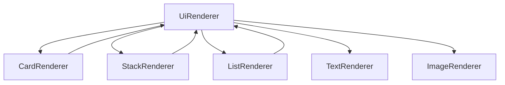

# Components

Android Compose renderers that map resolved `UiNode` types to widgets.

`UiRenderer` is the dispatcher: it pattern-matches on the node type and delegates to one of the renderers below. Children are rendered by calling `UiRenderer` recursively.



Styles listed per component are only those the **renderer actually reads**. Other `Style` fields may be present on the node but ignored by that composable. Actions mean `node.action` handled via `clickableAction` → ViewModel `onAction` (`NavigateAction` / `ToastAction`).

---

## CardRenderer

Maps `CardNode` → Material 3 `Card` with a vertical content column.

### Responsibilities

- Draw a surfaced container with optional rounded corners and background color  
- Apply size / margin from style to the card  
- Apply content padding inside the card  
- Make the card tappable when `action` is non-null  
- Render `children` recursively through `UiRenderer`

### Supported styles

| Style field | How it is used |
|-------------|----------------|
| `width` / `height` | Via `ModifierMapper` on the `Card` |
| `margin` | Via `ModifierMapper` (outer padding) |
| `cornerRadius` | `ShapeMapper` → card `shape` |
| `backgroundColor` | `ColorMapper` → `CardDefaults.cardColors`; fallback `colorScheme.surface` |
| `padding` | Inner `Column` padding |

Not applied by this renderer: `textColor`, `fontSize`, `fontWeight`, `alignment`, `spacing`.

### Supported actions

| Action | Behavior |
|--------|----------|
| `NavigateAction` | Card click → `onAction` → navigate |
| `ToastAction` | Card click → `onAction` → toast |
| `null` | Not clickable |

Child nodes may carry their own actions independently.

### Example JSON

```json
{
  "type": "card",
  "id": "pokemon_card",
  "styleId": "card_container",
  "action": {
    "type": "navigate",
    "destination": "details",
    "params": { "id": "6" }
  },
  "children": [
    {
      "type": "text",
      "id": "name",
      "styleId": "card_title",
      "binding": "name"
    },
    {
      "type": "image",
      "id": "sprite",
      "binding": "imageUrl"
    }
  ]
}
```

### Resulting Compose hierarchy

```text
Card
└── Column          (content padding from style.padding)
    ├── TextRenderer / …
    └── ImageRenderer / …   (each child via UiRenderer)
```

---

## StackRenderer

Maps `StackNode` → `Column` (vertical) or `Row` (horizontal).

### Responsibilities

- Lay out children linearly by `orientation`  
- Apply size / margin / padding from style  
- Align children on the cross axis using `alignment`  
- Recursively render `children` via `UiRenderer`

### Supported styles

| Style field | How it is used |
|-------------|----------------|
| `width` / `height` | `ModifierMapper` on `Column` / `Row` |
| `margin` | `ModifierMapper` |
| `padding` | Extra padding on the container |
| `alignment` | Vertical stack → `horizontalAlignment`; horizontal stack → `verticalAlignment` |

Not applied: `backgroundColor`, `cornerRadius`, text styles, `spacing` (no `Arrangement.spacedBy` today).

### Supported actions

| Action | Behavior |
|--------|----------|
| Any `node.action` | **Not wired** — `StackRenderer` does not call `clickableAction` |

Put actions on children (or wrap the stack in a `card`) if the container itself must be tappable.

### Example JSON

```json
{
  "type": "stack",
  "id": "header_stack",
  "orientation": "vertical",
  "styleId": "header_stack_style",
  "children": [
    {
      "type": "text",
      "id": "title",
      "binding": "title"
    },
    {
      "type": "text",
      "id": "subtitle",
      "binding": "subtitle"
    }
  ]
}
```

Horizontal:

```json
{
  "type": "stack",
  "id": "row_stack",
  "orientation": "horizontal",
  "children": [
    { "type": "image", "id": "icon", "binding": "iconUrl" },
    { "type": "text", "id": "label", "binding": "label" }
  ]
}
```

### Resulting Compose hierarchy

**Vertical**

```text
Column
├── child₀ via UiRenderer
├── child₁ via UiRenderer
└── …
```

**Horizontal**

```text
Row
├── child₀ via UiRenderer
├── child₁ via UiRenderer
└── …
```

---

## ListRenderer

Maps `ListNode` → `LazyColumn` or `LazyRow`.

### Responsibilities

- Scroll a variable number of **resolved items** (`List<List<UiNode>>`)  
- Choose vertical vs horizontal lazy list from `orientation`  
- Apply size / margin / padding to the lazy list  
- For each item, render its node list through `UiRenderer`

List **data expansion** (binding → rows) already happened in shared runtime. This renderer only paints `node.items`.

### Supported styles

| Style field | How it is used |
|-------------|----------------|
| `width` / `height` | `ModifierMapper` on `LazyColumn` / `LazyRow` |
| `margin` | `ModifierMapper` |
| `padding` | Padding on the lazy list |

Not applied: `backgroundColor`, `cornerRadius`, `alignment`, `spacing`, text styles.

### Supported actions

| Action | Behavior |
|--------|----------|
| Any `node.action` on the `ListNode` | **Not wired** — no `clickableAction` on the list itself |

Per-item / per-child actions still work if those child nodes have actions.

### Example JSON

Definition (item template + list binding):

```json
{
  "type": "list",
  "id": "moves_list",
  "orientation": "vertical",
  "binding": "moves",
  "styleId": "moves_list_style",
  "children": [
    {
      "type": "text",
      "id": "move_name",
      "binding": "name"
    }
  ]
}
```

Feed data for that binding:

```json
{
  "moves": [
    { "name": "Flamethrower" },
    { "name": "Fly" }
  ]
}
```

### Resulting Compose hierarchy

**Vertical**

```text
LazyColumn
├── item[0] → UiRenderer(nodes = [TextNode("Flamethrower"), …])
├── item[1] → UiRenderer(nodes = [TextNode("Fly"), …])
└── …
```

**Horizontal** — same structure with `LazyRow`.

Each lazy `item` is one resolved template instance (a `List<UiNode>`), not a single widget type.

---

## TextRenderer

Maps `TextNode` → Material 3 `Text`.

### Responsibilities

- Display resolved `node.text`  
- Apply typography / color from style  
- Apply size / margin via `ModifierMapper`  
- Make text tappable when `action` is set  

### Supported styles

| Style field | How it is used |
|-------------|----------------|
| `width` / `height` | `ModifierMapper` |
| `margin` | `ModifierMapper` |
| `textColor` | `TextStyleMapper` → `TextStyle.color` (else `LocalContentColor`) |
| `fontSize` | `TextStyleMapper` → `sp` |
| `fontWeight` | `TextStyleMapper` → Compose `FontWeight` |

Not applied here: `padding` (no padding extension on this composable), `backgroundColor`, `cornerRadius`, `alignment`, `spacing`.

### Supported actions

| Action | Behavior |
|--------|----------|
| `NavigateAction` / `ToastAction` | Text click via `clickableAction` |
| `null` | Not clickable |

### Example JSON

Static:

```json
{
  "type": "text",
  "id": "heading",
  "styleId": "card_title",
  "text": "Pokémon"
}
```

Bound + action:

```json
{
  "type": "text",
  "id": "pokemon_name",
  "styleId": "card_title",
  "binding": "name",
  "action": {
    "type": "toast",
    "message": "Name tapped"
  }
}
```

### Resulting Compose hierarchy

```text
Text(
  text = node.text,
  style = TextStyleMapper.map(node.style),
  modifier = ModifierMapper + clickableAction?
)
```

Leaf — no child `UiRenderer` calls.

---

## ImageRenderer

Maps `ImageNode` → Coil `AsyncImage`.

### Responsibilities

- Load `node.url` asynchronously  
- Size / margin via `ModifierMapper`  
- Clip to `cornerRadius` shape  
- Optional tap action  
- `ContentScale.Fit`  

Placeholder / error painters are not enabled (commented out in source).

### Supported styles

| Style field | How it is used |
|-------------|----------------|
| `width` / `height` | `ModifierMapper` (typical: fixed height or fill width) |
| `margin` | `ModifierMapper` |
| `cornerRadius` | `ShapeMapper` → `Modifier.clip` |

Not applied: `padding`, `backgroundColor`, text styles, `alignment`, `spacing`.

### Supported actions

| Action | Behavior |
|--------|----------|
| `NavigateAction` / `ToastAction` | Image click via `clickableAction` |
| `null` | Not clickable |

### Example JSON

```json
{
  "type": "image",
  "id": "pokemon_image",
  "styleId": "card_image",
  "binding": "imageUrl",
  "action": {
    "type": "navigate",
    "destination": "details"
  }
}
```

Or static URL:

```json
{
  "type": "image",
  "id": "logo",
  "url": "https://example.com/logo.png"
}
```

### Resulting Compose hierarchy

```text
AsyncImage(
  model = node.url,
  contentScale = Fit,
  modifier = ModifierMapper + clip(cornerRadius) + clickableAction?
)
```

Leaf — no child `UiRenderer` calls.

---

## Comparison

| Renderer | Node | Container? | Click on self? | Primary Compose API |
|----------|------|------------|----------------|---------------------|
| **CardRenderer** | `CardNode` | Yes (`children`) | Yes | `Card` + `Column` |
| **StackRenderer** | `StackNode` | Yes (`children`) | No | `Column` / `Row` |
| **ListRenderer** | `ListNode` | Yes (`items`) | No | `LazyColumn` / `LazyRow` |
| **TextRenderer** | `TextNode` | No | Yes | `Text` |
| **ImageRenderer** | `ImageNode` | No | Yes | `AsyncImage` |

### Style usage matrix

| Field | Card | Stack | List | Text | Image |
|-------|:----:|:-----:|:----:|:----:|:-----:|
| `width` / `height` | ✓ | ✓ | ✓ | ✓ | ✓ |
| `margin` | ✓ | ✓ | ✓ | ✓ | ✓ |
| `padding` | ✓ (inner) | ✓ | ✓ | — | — |
| `backgroundColor` | ✓ | — | — | — | — |
| `cornerRadius` | ✓ (shape) | — | — | — | ✓ (clip) |
| `alignment` | — | ✓ | — | — | — |
| `textColor` / `fontSize` / `fontWeight` | — | — | — | ✓ | — |
| `spacing` | — | — | — | — | — |

---

## Dispatch Reminder

```text
UiRenderer(node)
  ├── StackNode  → StackRenderer
  ├── CardNode   → CardRenderer
  ├── ListNode   → ListRenderer
  ├── TextNode   → TextRenderer
  └── ImageNode  → ImageRenderer
```

Shared produces the nodes; these composables only interpret them for Android.

---

*Related: [styles.md](./styles.md) · [rendering_pipeline.md](./rendering_pipeline.md) · [runtime.md](./runtime.md)*
