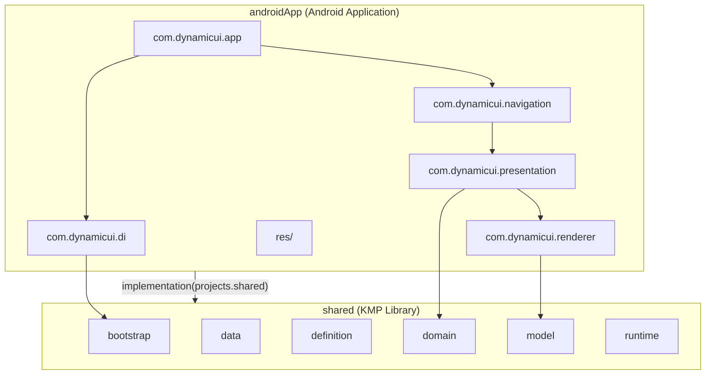
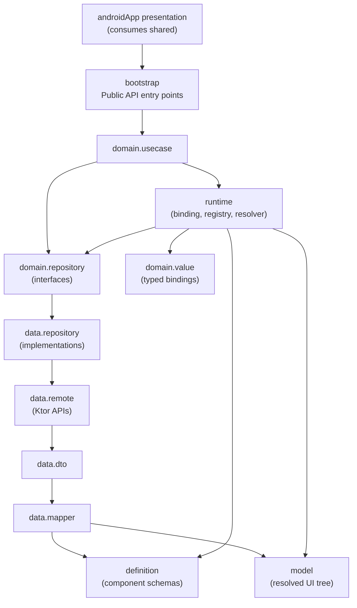
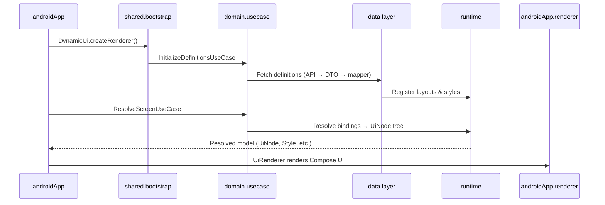

```mermaid
flowchart LR
    subgraph androidAppStructure["androidApp/"]
        direction TB

        BG["build.gradle.kts"]
        MAN["src/main/AndroidManifest.xml"]

        subgraph kotlin["src/main/kotlin/"]
            direction TB

            subgraph com_dynamicui["com.dynamicui"]
                direction TB

                subgraph app_pkg["app"]
                    A1["DynamicUiApplication.kt"]
                    A2["MainActivity.kt"]
                end

                subgraph di_pkg["di"]
                    D1["DynamicUiModule.kt"]
                end

                subgraph nav_pkg["navigation"]
                    N1["AppNavGraph.kt"]
                    N2["Destinations.kt"]
                    N3["Navigator.kt"]
                    N4["Screen.kt"]
                end

                subgraph pres_pkg["presentation"]
                    direction TB
                    subgraph pres_common["common"]
                        PC1["ScreenUiState.kt"]
                        PC2["UiEvent.kt"]
                    end
                    subgraph pres_details["details"]
                        PD1["DetailsScreen.kt"]
                        PD2["DetailsViewModel.kt"]
                    end
                    subgraph pres_home["home"]
                        PH1["HomeScreen.kt"]
                        PH2["HomeViewModel.kt"]
                    end
                end

                subgraph renderer_pkg["renderer"]
                    direction TB
                    R0["UiRenderer.kt"]

                    subgraph ren_action["action"]
                        RA1["ActionExtensions.kt"]
                    end
                    subgraph ren_components["components"]
                        RC1["CardRenderer.kt"]
                        RC2["ImageRenderer.kt"]
                        RC3["ListRenderer.kt"]
                        RC4["StackRenderer.kt"]
                        RC5["TextRenderer.kt"]
                    end
                    subgraph ren_ext["extensions"]
                        RE1["EdgeInsetsExtensions.kt"]
                    end
                    subgraph ren_mappers["mappers"]
                        RM1["AlignmentMapper.kt"]
                        RM2["ColorMapper.kt"]
                        RM3["ModifierMapper.kt"]
                        RM4["ShapeMapper.kt"]
                        RM5["TextStyleMapper.kt"]
                    end
                end
            end
        end

        subgraph res["src/main/res/"]
            direction TB
            R_DRAW["drawable/ · drawable-v24/"]
            R_MIP["mipmap-*/ (launcher icons)"]
            R_VAL["values/strings.xml"]
            R_XML["xml/network_security_config.xml"]
        end
    end
```

# Module Structure: androidApp & shared

Overview of all packages and files in the `androidApp` and `shared` modules.

## Module overview



---

## androidApp module

**Root:** `androidApp/`  
**Namespace:** `com.dynamicui`  
**Depends on:** `shared`

### File tree

```
androidApp/
├── build.gradle.kts
└── src/main/
    ├── AndroidManifest.xml
    ├── kotlin/
    │   └── com/dynamicui/
    │       ├── app/
    │       │   ├── DynamicUiApplication.kt
    │       │   └── MainActivity.kt
    │       ├── di/
    │       │   └── DynamicUiModule.kt
    │       ├── navigation/
    │       │   ├── AppNavGraph.kt
    │       │   ├── Destinations.kt
    │       │   ├── Navigator.kt
    │       │   └── Screen.kt
    │       ├── presentation/
    │       │   ├── common/
    │       │   │   ├── ScreenUiState.kt
    │       │   │   └── UiEvent.kt
    │       │   ├── details/
    │       │   │   ├── DetailsScreen.kt
    │       │   │   └── DetailsViewModel.kt
    │       │   └── home/
    │       │       ├── HomeScreen.kt
    │       │       └── HomeViewModel.kt
    │       └── renderer/
    │           ├── UiRenderer.kt
    │           ├── action/
    │           │   └── ActionExtensions.kt
    │           ├── components/
    │           │   ├── CardRenderer.kt
    │           │   ├── ImageRenderer.kt
    │           │   ├── ListRenderer.kt
    │           │   ├── StackRenderer.kt
    │           │   └── TextRenderer.kt
    │           ├── extensions/
    │           │   └── EdgeInsetsExtensions.kt
    │           └── mappers/
    │               ├── AlignmentMapper.kt
    │               ├── ColorMapper.kt
    │               ├── ModifierMapper.kt
    │               ├── ShapeMapper.kt
    │               └── TextStyleMapper.kt
    └── res/
        ├── drawable/
        │   └── ic_launcher_background.xml
        ├── drawable-v24/
        │   └── ic_launcher_foreground.xml
        ├── mipmap-anydpi-v26/
        │   ├── ic_launcher.xml
        │   └── ic_launcher_round.xml
        ├── mipmap-hdpi/          (launcher icons)
        ├── mipmap-mdpi/          (launcher icons)
        ├── mipmap-xhdpi/         (launcher icons)
        ├── mipmap-xxhdpi/        (launcher icons)
        ├── mipmap-xxxhdpi/       (launcher icons)
        ├── values/
        │   └── strings.xml
        └── xml/
            └── network_security_config.xml
```

### Package summary

| Package | Files | Role |
|---|---|---|
| `com.dynamicui.app` | 2 | Application entry + `MainActivity` |
| `com.dynamicui.di` | 1 | Hilt DI wiring (`DynamicUi.createRenderer()`) |
| `com.dynamicui.navigation` | 4 | Nav graph, destinations, navigator |
| `com.dynamicui.presentation.common` | 2 | Shared UI state & events |
| `com.dynamicui.presentation.home` | 2 | Home screen + ViewModel |
| `com.dynamicui.presentation.details` | 2 | Details screen + ViewModel |
| `com.dynamicui.renderer` | 1 | Root `UiRenderer` (UiNode → Compose) |
| `com.dynamicui.renderer.components` | 5 | Per-node Compose renderers |
| `com.dynamicui.renderer.mappers` | 5 | Style/layout → Compose mappers |
| `com.dynamicui.renderer.action` | 1 | Clickable action helpers |
| `com.dynamicui.renderer.extensions` | 1 | EdgeInsets helpers |
| `res/` | ~15 | Launcher icons, strings, network config |

### Package diagram



---

## shared module

**Root:** `shared/`  
**Namespace:** `com.dynamicui.shared`  
**Source sets:** `commonMain` (77 Kotlin files), `androidMain` (empty — platform hook only)

### File tree

```
shared/
├── build.gradle.kts
└── src/
    ├── androidMain/                    (empty — platform-specific hook)
    └── commonMain/kotlin/com/dynamicui/shared/
        ├── bootstrap/
        │   ├── DynamicUi.kt
        │   ├── DynamicUiRenderer.kt
        │   └── RendererFactory.kt      (internal)
        ├── data/
        │   ├── dto/
        │   │   ├── action/
        │   │   │   └── UiActionDto.kt
        │   │   ├── definitions/
        │   │   │   ├── CardDefinitionDto.kt
        │   │   │   ├── ComponentDefinitionDto.kt
        │   │   │   ├── ImageDefinitionDto.kt
        │   │   │   ├── LayoutDefinitionDto.kt
        │   │   │   ├── ListDefinitionDto.kt
        │   │   │   ├── StackDefinitionDto.kt
        │   │   │   ├── StyleDefinitionDto.kt
        │   │   │   ├── TextDefinitionDto.kt
        │   │   │   └── UiDefinitionsDto.kt
        │   │   └── feed/
        │   │       ├── FeedDto.kt
        │   │       └── FeedItemDto.kt
        │   ├── mapper/
        │   │   ├── ActionMapper.kt
        │   │   ├── FeedMapper.kt
        │   │   ├── FeedMapperImpl.kt
        │   │   ├── Mapper.kt
        │   │   ├── StyleValueMapper.kt
        │   │   ├── UiDefinitionsMapper.kt
        │   │   └── UiDefinitionsMapperImpl.kt
        │   ├── network/
        │   │   ├── ApiConfig.kt
        │   │   ├── HttpClientProvider.kt
        │   │   └── SerializationModule.kt
        │   ├── remote/
        │   │   ├── DefinitionsApi.kt
        │   │   └── FeedApi.kt
        │   └── repository/
        │       ├── DefinitionsRepositoryImpl.kt
        │       └── FeedRepositoryImpl.kt
        ├── definition/
        │   ├── CardDefinition.kt
        │   ├── ComponentDefinition.kt
        │   ├── ImageDefinition.kt
        │   ├── ListDefinition.kt
        │   ├── StackDefinition.kt
        │   └── TextDefinition.kt
        ├── domain/
        │   ├── model/
        │   │   ├── Feed.kt
        │   │   ├── FeedItem.kt
        │   │   ├── LayoutDefinition.kt
        │   │   └── UiDefinitions.kt
        │   ├── repository/
        │   │   ├── DefinitionsRepository.kt
        │   │   └── FeedRepository.kt
        │   ├── usecase/
        │   │   ├── InitializeDefinitionsUseCase.kt
        │   │   └── ResolveScreenUseCase.kt
        │   └── value/
        │       ├── BindingKey.kt
        │       ├── BooleanValue.kt
        │       ├── Ids.kt
        │       ├── ListValue.kt
        │       ├── NullValue.kt
        │       ├── NumberValue.kt
        │       ├── ObjectValue.kt
        │       ├── StringValue.kt
        │       ├── UiValue.kt
        │       └── UiValueExtensions.kt
        ├── model/
        │   ├── action/
        │   │   └── UiAction.kt
        │   ├── common/
        │   │   └── Orientation.kt
        │   ├── node/
        │   │   ├── CardNode.kt
        │   │   ├── ImageNode.kt
        │   │   ├── ListNode.kt
        │   │   ├── StackNode.kt
        │   │   ├── TextNode.kt
        │   │   └── UiNode.kt
        │   └── style/
        │       ├── Alignment.kt
        │       ├── CornerRadius.kt
        │       ├── Dimension.kt
        │       ├── EdgeInsets.kt
        │       ├── FontWeight.kt
        │       └── Style.kt
        └── runtime/
            ├── binding/
            │   ├── BindingContext.kt
            │   ├── BindingResolver.kt
            │   └── BindingResolverImpl.kt
            ├── registry/
            │   ├── LayoutRegistry.kt
            │   ├── LayoutRegistryImpl.kt
            │   ├── StyleRegistry.kt
            │   └── StyleRegistryImpl.kt
            ├── resolver/
            │   ├── UiRuntimeResolver.kt
            │   └── UiRuntimeResolverImpl.kt
            └── state/
                └── InitializationState.kt
```

### Package summary

| Package | Files | Role |
|---|---|---|
| `bootstrap` | 3 | Public API (`DynamicUi`, `DynamicUiRenderer`); `RendererFactory` is internal |
| `data.dto.action` | 1 | Action wire format |
| `data.dto.definitions` | 9 | UI definition DTOs |
| `data.dto.feed` | 2 | Feed wire format |
| `data.mapper` | 7 | DTO → domain/definition mapping |
| `data.network` | 3 | HTTP client & serialization |
| `data.remote` | 2 | Ktor API clients |
| `data.repository` | 2 | Repository implementations |
| `definition` | 6 | Component schema definitions |
| `domain.model` | 4 | Domain models |
| `domain.repository` | 2 | Repository interfaces |
| `domain.usecase` | 2 | Business logic use cases |
| `domain.value` | 10 | Typed binding values |
| `model.action` | 1 | Resolved actions (`Navigate`, `Toast`) |
| `model.common` | 1 | Shared enums (`Orientation`) |
| `model.node` | 6 | Resolved UI tree nodes |
| `model.style` | 6 | Resolved style types |
| `runtime.binding` | 3 | Data binding resolution |
| `runtime.registry` | 4 | Layout & style registries |
| `runtime.resolver` | 2 | UI runtime resolution |
| `runtime.state` | 1 | Initialization state |

### Package diagram



```mermaid
flowchart TB
    subgraph sharedStructure["shared/src/commonMain/kotlin/com.dynamicui.shared/"]
        direction TB

        subgraph bootstrap["bootstrap"]
            B1["DynamicUi.kt"]
            B2["DynamicUiRenderer.kt"]
            B3["RendererFactory.kt (internal)"]
        end

        subgraph data_layer["data"]
            direction TB

            subgraph dto_action["dto.action"]
                DA1["UiActionDto.kt"]
            end
            subgraph dto_defs["dto.definitions"]
                DD1["CardDefinitionDto.kt"]
                DD2["ComponentDefinitionDto.kt"]
                DD3["ImageDefinitionDto.kt"]
                DD4["LayoutDefinitionDto.kt"]
                DD5["ListDefinitionDto.kt"]
                DD6["StackDefinitionDto.kt"]
                DD7["StyleDefinitionDto.kt"]
                DD8["TextDefinitionDto.kt"]
                DD9["UiDefinitionsDto.kt"]
            end
            subgraph dto_feed["dto.feed"]
                DF1["FeedDto.kt"]
                DF2["FeedItemDto.kt"]
            end
            subgraph mapper["mapper"]
                M1["ActionMapper.kt"]
                M2["FeedMapper.kt"]
                M3["FeedMapperImpl.kt"]
                M4["Mapper.kt"]
                M5["StyleValueMapper.kt"]
                M6["UiDefinitionsMapper.kt"]
                M7["UiDefinitionsMapperImpl.kt"]
            end
            subgraph network["network"]
                NW1["ApiConfig.kt"]
                NW2["HttpClientProvider.kt"]
                NW3["SerializationModule.kt"]
            end
            subgraph remote["remote"]
                R1["DefinitionsApi.kt"]
                R2["FeedApi.kt"]
            end
            subgraph repo_impl["repository"]
                RI1["DefinitionsRepositoryImpl.kt"]
                RI2["FeedRepositoryImpl.kt"]
            end
        end

        subgraph definition["definition"]
            DEF1["CardDefinition.kt"]
            DEF2["ComponentDefinition.kt"]
            DEF3["ImageDefinition.kt"]
            DEF4["ListDefinition.kt"]
            DEF5["StackDefinition.kt"]
            DEF6["TextDefinition.kt"]
        end

        subgraph domain_layer["domain"]
            direction TB
            subgraph dom_model["model"]
                DM1["Feed.kt"]
                DM2["FeedItem.kt"]
                DM3["LayoutDefinition.kt"]
                DM4["UiDefinitions.kt"]
            end
            subgraph dom_repo["repository"]
                DR1["DefinitionsRepository.kt"]
                DR2["FeedRepository.kt"]
            end
            subgraph dom_usecase["usecase"]
                DU1["InitializeDefinitionsUseCase.kt"]
                DU2["ResolveScreenUseCase.kt"]
            end
            subgraph dom_value["value"]
                DV1["BindingKey.kt"]
                DV2["BooleanValue.kt"]
                DV3["Ids.kt"]
                DV4["ListValue.kt"]
                DV5["NullValue.kt"]
                DV6["NumberValue.kt"]
                DV7["ObjectValue.kt"]
                DV8["StringValue.kt"]
                DV9["UiValue.kt"]
                DV10["UiValueExtensions.kt"]
            end
        end

        subgraph model_pkg["model"]
            direction TB
            subgraph model_action["action"]
                MA1["UiAction.kt"]
            end
            subgraph model_common["common"]
                MC1["Orientation.kt"]
            end
            subgraph model_node["node"]
                MN1["UiNode.kt"]
                MN2["TextNode.kt"]
                MN3["ImageNode.kt"]
                MN4["StackNode.kt"]
                MN5["CardNode.kt"]
                MN6["ListNode.kt"]
            end
            subgraph model_style["style"]
                MS1["Style.kt"]
                MS2["Dimension.kt"]
                MS3["EdgeInsets.kt"]
                MS4["CornerRadius.kt"]
                MS5["Alignment.kt"]
                MS6["FontWeight.kt"]
            end
        end

        subgraph runtime["runtime"]
            direction TB
            subgraph rt_binding["binding"]
                RB1["BindingContext.kt"]
                RB2["BindingResolver.kt"]
                RB3["BindingResolverImpl.kt"]
            end
            subgraph rt_registry["registry"]
                RR1["LayoutRegistry.kt"]
                RR2["LayoutRegistryImpl.kt"]
                RR3["StyleRegistry.kt"]
                RR4["StyleRegistryImpl.kt"]
            end
            subgraph rt_resolver["resolver"]
                RS1["UiRuntimeResolver.kt"]
                RS2["UiRuntimeResolverImpl.kt"]
            end
            subgraph rt_state["state"]
                RST1["InitializationState.kt"]
            end
        end
    end
```

### Layer architecture



---

## Quick stats

| Module | Kotlin files | Other notable files |
|---|---|---|
| **androidApp** | 26 | `build.gradle.kts`, `AndroidManifest.xml`, ~15 `res/` assets |
| **shared** | 77 | `build.gradle.kts`, empty `androidMain/` |

## End-to-end data flow


