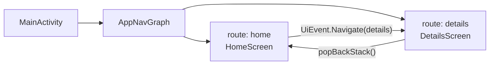
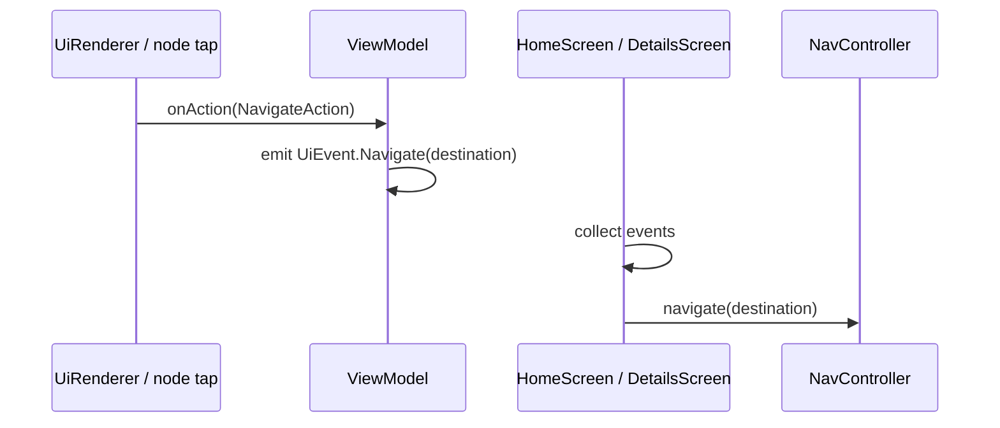

# Navigation

How screens are registered, how content is loaded, and how the backend can drive navigation through actions on dynamic UI nodes.

Navigation has two layers:

1. **App navigation** — Compose Navigation routes (`home`, `details`) owned by `androidApp`  
2. **Backend-driven navigation** — `NavigateAction` on resolved nodes, executed when the user taps  

```text
MainActivity
  → AppNavGraph (NavHost)
      → HomeScreen / DetailsScreen
          → ViewModel.resolveScreen(screenId)
          → UiRenderer + onAction
              → NavigateAction → UiEvent.Navigate → navController.navigate
```

---

## Route Table (NavGraph)

`AppNavGraph` owns the single `NavHost` for the app.



Routes are declared on `Screen`:

| Screen object | Route string | Composable |
|---------------|--------------|------------|
| `Screen.Home` | `"home"` | `HomeScreen` |
| `Screen.Details` | `"details"` | `DetailsScreen` |

Start destination: **`home`**.

Both destinations receive the same `NavController`. There is no nested graph and no type-safe argument routes today — destinations are plain strings.

---

## HomeScreen

Entry screen of the app.

### Responsibilities

- Observe `HomeViewModel` UI state (`Loading` / `Success` / `Error`)  
- On success, render dynamic nodes with `UiRenderer`  
- Collect one-shot `UiEvent`s and run side effects (navigate / toast)  
- Pass `viewModel::onAction` into the renderer so taps can trigger backend actions  

### Content loading

On ViewModel init:

```text
DynamicUiRenderer.resolveScreen(screenId = "home")
```

The string `"home"` matches both the **Navigation route** and the **feed API** path segment (`/feed/home`). That alignment is intentional: the screen id is backend-owned content identity, reused as the client route name.

### Chrome

- `Scaffold` without a top app bar  
- Body is either a spinner, error text, or a `Column` of dynamic UI  

---

## DetailsScreen

Secondary screen reached by navigation (typically from a `NavigateAction`).

### Responsibilities

- Same load / render / event pattern as Home  
- Provide a **local** back affordance via top app bar  
- Load dynamic content for `screenId = "details"`  

### Content loading

```text
DynamicUiRenderer.resolveScreen(screenId = "details")
```

### Chrome

- `CenterAlignedTopAppBar` titled `"Details"`  
- Back `IconButton` → `navController.popBackStack()` (client-owned, not from JSON)  
- Body identical pattern: loading / success (`UiRenderer`) / error  

Back stack pop is **not** modeled as a `NavigateAction`; it is hard-coded UI chrome.

---

## UiEvent

Presentation-layer side effects emitted by ViewModels and consumed by screens.

```kotlin
sealed interface UiEvent {
    data class Navigate(val destination: String) : UiEvent
    data class ShowToast(val message: String) : UiEvent
}
```

| Event | Emitted when | Handled by screen |
|-------|--------------|-------------------|
| `Navigate` | `NavigateAction` received in `onAction` | `navController.navigate(destination)` |
| `ShowToast` | `ToastAction` received in `onAction` | `Toast.makeText(...).show()` |

ViewModels expose events as a `SharedFlow`. Screens collect in `LaunchedEffect` so navigation/toasts stay out of the ViewModel (no `NavController` in the VM).



---

## NavigateAction

Shared-domain action attached to a `UiNode` (from a component definition or feed item). Produced in `shared`; executed only in `androidApp`.

```kotlin
data class NavigateAction(
    val destination: String,
    val params: Map<String, String> = emptyMap(),
) : UiAction
```

### JSON examples

On a component:

```json
{
  "type": "card",
  "id": "pokemon_card",
  "action": {
    "type": "navigate",
    "destination": "details",
    "params": { "id": "6" }
  },
  "children": [ ]
}
```

On a feed item (mapped onto domain; still a `UiAction` on the item / carried through resolve onto nodes as defined by the pipeline):

```json
{
  "id": "charizard",
  "layoutId": "pokemon_card_layout",
  "data": { "name": "Charizard" },
  "action": {
    "type": "navigate",
    "destination": "details",
    "params": { "pokemonId": "6" }
  }
}
```

### What the app does today

| Field | Used? |
|-------|--------|
| `destination` | Yes — becomes `UiEvent.Navigate.destination` → `navController.navigate` |
| `params` | Carried on the domain action but **not** applied to the route (no nav arguments wired) |

For navigation to succeed, `destination` must match a registered route (`"home"` or `"details"`). An unknown string will not open a defined screen.

---

## How Backend-Driven Navigation Works

The backend does not call `NavController`. It **declares intent** on UI nodes; the app **interprets** that intent.

```mermaid
flowchart TB
    subgraph Backend
        JSON["JSON action<br/>type: navigate<br/>destination: details"]
    end

    subgraph Shared
        Map["ActionMapper"]
        Node["UiNode.action = NavigateAction"]
        Map --> Node
    end

    subgraph Android
        Tap["User taps Card / Text / Image"]
        VM["ViewModel.onAction"]
        Ev["UiEvent.Navigate"]
        Nav["navController.navigate"]
        Det["DetailsScreen"]
        Load["resolveScreen(\"details\")"]
    end

    JSON --> Map
    Node --> Tap --> VM --> Ev --> Nav --> Det --> Load
```

### Step by step

1. **Authoring** — Definitions or feed include `"type": "navigate"` with a `destination` string.  
2. **Resolve** — Shared maps that to `NavigateAction` and attaches it to the relevant `UiNode`.  
3. **Render** — Compose renderers that support clicks (`Card`, `Text`, `Image`) call `onAction` when tapped.  
4. **Translate** — ViewModel maps `NavigateAction` → `UiEvent.Navigate(destination)`.  
5. **Execute** — Screen calls `navController.navigate(destination)`.  
6. **Load target content** — Destination screen’s ViewModel calls `resolveScreen` with its own screen id (`"details"`), fetching that screen’s feed and rendering another dynamic tree.

So the backend chooses **where to go** (route name). The client owns **how routes exist** (NavHost) and **what content API** each route loads (`resolveScreen(screenId)`).

### Dual use of the same string

| Layer | Meaning of `"details"` |
|-------|-------------------------|
| Navigation | Compose route registered in `AppNavGraph` |
| Content | `screenId` for `GET …/feed/details` |

Keeping them aligned lets the backend say `"destination": "details"` and land on a screen that loads the details feed without a separate client mapping table.

### What is *not* backend-driven

| Concern | Owner |
|---------|--------|
| Which routes exist | Client (`Screen` + `AppNavGraph`) |
| Start destination | Client (`home`) |
| Back button on Details | Client (`popBackStack`) |
| Passing `params` into the destination ViewModel / route | Not implemented yet |
| Deep links | Not configured |

Adding a new backend destination requires a matching client route (and usually a screen that knows which `screenId` to resolve) unless you later generalize that mapping.

---

## End-to-End Example

User on Home taps a card whose action is navigate → `details`:

```mermaid
sequenceDiagram
    participant User
    participant Home as HomeScreen
    participant HVM as HomeViewModel
    participant Nav as NavController
    participant Details as DetailsScreen
    participant DVM as DetailsViewModel
    participant Shared as DynamicUiRenderer

    User->>Home: tap Card with NavigateAction(details)
    Home->>HVM: onAction(NavigateAction)
    HVM->>Home: UiEvent.Navigate("details")
    Home->>Nav: navigate("details")
    Nav->>Details: compose DetailsScreen
    Details->>DVM: init
    DVM->>Shared: resolveScreen("details")
    Shared-->>DVM: List of UiNode
    DVM-->>Details: Success → UiRenderer
    User->>Details: tap Back
    Details->>Nav: popBackStack()
    Nav->>Home: resume Home
```

---

## Mental Model

| Piece | Role |
|-------|------|
| **AppNavGraph** | Declares legal places the app can be |
| **HomeScreen / DetailsScreen** | Shell + event sink + `UiRenderer` host |
| **UiEvent** | Bridge from ViewModel intents to UI side effects |
| **NavigateAction** | Backend-declared “go somewhere” payload on a node |
| **resolveScreen(screenId)** | Backend-declared **content** for the screen you landed on |

Navigation chrome is local. Navigation **targets** and screen **trees** can be steered by JSON — within the route set the client has registered.

---

*Related: [components.md](./components.md) · [rendering_pipeline.md](./rendering_pipeline.md) · [architecture.md](./architecture.md)*
