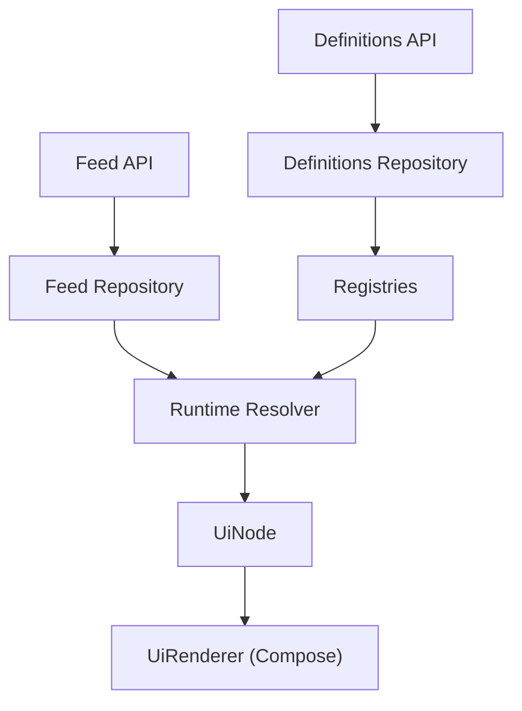
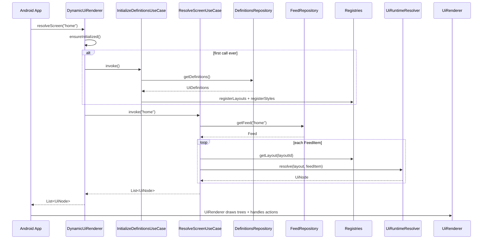

# Renderer Flow

How a backend JSON payload becomes pixels on screen.

**Start here if you want to understand the engine.** For project layout see [architecture.md](./architecture.md). For JSON shapes see [backend-contract.md](./backend-contract.md).

---

## The Pipeline



| Stage | Module | What happens |
|-------|--------|--------------|
| Definitions API | `shared/data` | HTTP GET `/ui-definitions` |
| Definitions Repository | `shared/data` | API → mapper → domain |
| Registries | `shared/runtime` | Cache layouts and styles in memory |
| Feed API | `shared/data` | HTTP GET `/feed/{screenId}` |
| Feed Repository | `shared/data` | API → mapper → domain |
| Runtime Resolver | `shared/runtime` | Layout + feed item → `UiNode` tree |
| UiNode | `shared/model/node` | Resolved, platform-agnostic UI tree |
| UiRenderer | `androidApp/renderer` | `UiNode` → Jetpack Compose widgets |

Everything through **UiNode** is implemented in `shared`. **UiRenderer** is the Android presentation step — where `UiNode` trees become Composables on screen.

---

## Entry Point

All rendering starts with one call:

```kotlin
val renderer = DynamicUi.createRenderer()
val nodes: List<UiNode> = renderer.resolveScreen("home")
```

| Piece | Class | Role |
|-------|-------|------|
| Public factory | `DynamicUi` | Calls internal `RendererFactory` |
| Public API | `DynamicUiRenderer` | Hides initialization; returns `List<UiNode>` |
| Screen ID | `String` | Backend-owned identifier, e.g. `"home"` |

In `androidApp`, Hilt injects `DynamicUiRenderer` into ViewModels. You never call use cases, APIs, or registries directly.

---

## Full Sequence



---

## Phase 1 — Load Definitions (once)

Runs automatically on the **first** `resolveScreen()` call. Skipped on every call after that.

```text
DefinitionsApi
    → DefinitionsRepositoryImpl
    → UiDefinitionsMapperImpl
    → InitializeDefinitionsUseCase
    → LayoutRegistry + StyleRegistry
```

### Step by step

1. **`DefinitionsApi`** — `GET …/ui-definitions`, deserializes to `UiDefinitionsDto`
2. **`DefinitionsRepositoryImpl`** — calls API, passes DTO to mapper, returns `UiDefinitions`
3. **`UiDefinitionsMapperImpl`** — converts DTOs to domain types:
   - `String` ids → `LayoutId`, `StyleId`, `ComponentId`
   - JSON components → `TextDefinition`, `ImageDefinition`, `StackDefinition`, etc.
   - JSON styles → `Style` via `StyleValueMapper` (dimensions, insets, alignment, font weight)
   - JSON actions → `NavigateAction`, `ToastAction` via `ActionMapper`
4. **`InitializeDefinitionsUseCase`** — writes into registries:
   - `layoutRegistry.registerLayouts(definitions.layouts)`
   - `styleRegistry.registerStyles(definitions.styles)`

### What gets cached

| Registry | Stores | Key type |
|----------|--------|----------|
| `LayoutRegistry` | Layout templates | `LayoutId` |
| `StyleRegistry` | Style properties | `StyleId` |

Definitions stay in memory for the lifetime of the `DynamicUiRenderer` instance.

---

## Phase 2 — Resolve a Screen (every call)

```text
FeedApi
    → FeedRepositoryImpl
    → FeedMapperImpl
    → ResolveScreenUseCase
    → UiRuntimeResolverImpl
    → List<UiNode>
```

### Step by step

1. **`FeedApi`** — `GET /feed/{screenId}`, deserializes to `FeedDto`
2. **`FeedRepositoryImpl`** — calls API, passes DTO to mapper, returns `Feed`
3. **`FeedMapperImpl`** — converts each `FeedItemDto`:
   - `id` → `ComponentId`
   - `layoutId` → `LayoutId`
   - `data` keys → `BindingKey`, values → `UiValue`
   - `action` → domain `UiAction`
4. **`ResolveScreenUseCase`** — for each `FeedItem`:
   - Looks up `layoutRegistry.getLayout(feedItem.layoutId)`
   - If layout missing → item is **skipped**
   - If found → passes layout + feed item to runtime resolver
5. Returns `List<UiNode>` — one root node per successfully resolved feed item

---

## Phase 3 — Runtime Resolution

`UiRuntimeResolverImpl` is the core engine. It takes a **layout template** + **feed item** and walks the component tree recursively.

```text
LayoutDefinition.root (ComponentDefinition)
    → resolveComponent()  ← recursive
    → UiNode tree
```

### Component mapping

| Definition | Runtime Node |
|------------|--------------|
| `TextDefinition` | `TextNode` |
| `ImageDefinition` | `ImageNode` |
| `StackDefinition` | `StackNode` |
| `CardDefinition` | `CardNode` |
| `ListDefinition` | `ListNode` |

Container nodes (`Stack`, `Card`, `List`) call `resolveChildren()` which maps each child through `resolveComponent()` — that's the recursion.

---

## Binding Resolution

Bindings connect **template placeholders** to **feed data**.

```text
TextDefinition.binding = "pokemon_name"
    → BindingResolverImpl looks up BindingKey("pokemon_name") in FeedItem.data
    → returns UiValue
    → .asString() → "Charizard"
    → TextNode.text = "Charizard"
```

| Rule | Behavior |
|------|----------|
| Static value set (`text`, `url`) | Uses static value; binding ignored |
| Binding set, no static value | Looks up key in `feedItem.data` |
| Binding missing from data | Falls back to `""` |
| Binding key is null | Falls back to `""` |

**Class:** `BindingResolverImpl` — a simple map lookup, no network, no logic.

---

## Style Resolution

Definitions reference styles by ID. Runtime nodes carry the **resolved** style object.

```text
TextDefinition.styleId = StyleId("card_title")
    → StyleRegistry.getStyle(styleId)
    → Style(textColor = "#FFFFFF", padding = EdgeInsets(...), ...)
    → TextNode.style = Style(...)
```

| Rule | Behavior |
|------|----------|
| `styleId` present | Lookup in `StyleRegistry` |
| `styleId` null | `node.style = null` |
| Style ID not in registry | `node.style = null` |

Styles are loaded during Phase 1 and never re-fetched per screen. See [backend-contract.md](./backend-contract.md) for the full style field list (`width`, `height`, `padding`, `margin`, `fontWeight`, `alignment`, etc.).

---

## Action Resolution

Actions are **not executed** in `shared`. They are **passed through** from definitions onto runtime nodes.

| Action | On the node | Executed by |
|--------|-------------|-------------|
| `NavigateAction` | `destination: String`, `params: Map<String, String>` | `androidApp` via `UiEvent.Navigate` |
| `ToastAction` | `message: String` | `androidApp` via `UiEvent.ShowToast` |

The shared module's job ends at attaching `action: UiAction?` to each `UiNode`. Screens collect ViewModel events and run navigation or show a toast.

---

## UiNode Output

The final product of `shared`. A fully resolved tree — no raw IDs, no unresolved bindings.

Every node has:

```kotlin
sealed interface UiNode {
    val id: ComponentId
    val style: Style?
    val action: UiAction?
}
```

Plus type-specific fields:

| Node | Extra fields |
|------|-------------|
| `TextNode` | `text: String` |
| `ImageNode` | `url: String` |
| `StackNode` | `orientation: Orientation`, `children: List<UiNode>` |
| `CardNode` | `children: List<UiNode>` |
| `ListNode` | `orientation: Orientation`, `children: List<UiNode>` |

Example return value for one feed item:

```text
CardNode
├── TextNode  (text = "Charizard")
└── ImageNode (url = "https://…/6.png")
```

---

## Compose Renderer

The last step lives in **`androidApp`**, not `shared`.

```text
List<UiNode>
    → UiRenderer(nodes, onAction)
    → when (node) { is TextNode → TextRenderer … }
    → Jetpack Compose UI on screen
```

| Responsibility | Owner |
|----------------|-------|
| Produce `UiNode` trees | `shared` (`DynamicUiRenderer`) |
| Map `UiNode` → Composables | `androidApp` (`UiRenderer` + component renderers) |
| Handle tap → navigate / toast | `androidApp` (ViewModels → `UiEvent`) |

Home and Details screens already call `UiRenderer` with resolved nodes. Component renderers live under `com.dynamicui.renderer.components`; style mapping helpers live under `com.dynamicui.renderer.mappers`.

---

## Initialization State

`DynamicUiRenderer` tracks whether definitions have been loaded:

```text
NotInitialized  →  first resolveScreen() loads definitions
Initialized     →  subsequent calls skip the definitions fetch
```

State is internal to `DynamicUiRenderer`. Callers never manage it.

---

## Class Map

Quick lookup — which class owns each stage:

| Stage | Key classes |
|-------|-------------|
| Definitions API | `DefinitionsApi`, `ApiConfig` |
| Definitions Repository | `DefinitionsRepositoryImpl`, `UiDefinitionsMapperImpl`, `StyleValueMapper` |
| Feed API | `FeedApi` |
| Feed Repository | `FeedRepositoryImpl`, `FeedMapperImpl`, `ActionMapper` |
| Registries | `LayoutRegistryImpl`, `StyleRegistryImpl` |
| Use cases | `InitializeDefinitionsUseCase`, `ResolveScreenUseCase` |
| Binding | `BindingResolverImpl` |
| Runtime | `UiRuntimeResolverImpl` |
| Output | `TextNode`, `ImageNode`, `StackNode`, `CardNode`, `ListNode` |
| Public API | `DynamicUi`, `DynamicUiRenderer` |
| Compose | `UiRenderer`, component renderers, mappers |

---

## Common Questions

**Why fetch definitions and feed separately?**
Definitions are reusable templates. Feed is per-screen content. One layout can serve many feed items across different screens.

**Why registries instead of passing definitions every time?**
Definitions change rarely. Fetch once, cache in memory, reuse on every screen resolution.

**What if a feed item references an unknown layout?**
It is silently dropped (`mapNotNull` returns null). The rest of the feed still renders.

**Why `List<UiNode>` and not a single tree?**
Each feed item is an independent card/row with its own layout. The list length matches the feed item count.

**Can I call `resolveScreen()` from iOS?**
The pipeline is in `shared/commonMain`. Any platform that depends on `shared` gets the same `DynamicUiRenderer` API. Only the Compose / `UiRenderer` step is Android-specific.

---

## Related Docs

| Question | Document |
|----------|----------|
| How is the project structured? | [architecture.md](./architecture.md) |
| Full file listing? | [module-structure.md](./module-structure.md) |
| What JSON does the backend send? | [backend-contract.md](./backend-contract.md) |
| How do I add a new component? | [adding-a-component.md](./adding-a-component.md) |
| What's planned next? | [roadmap.md](./roadmap.md) |
