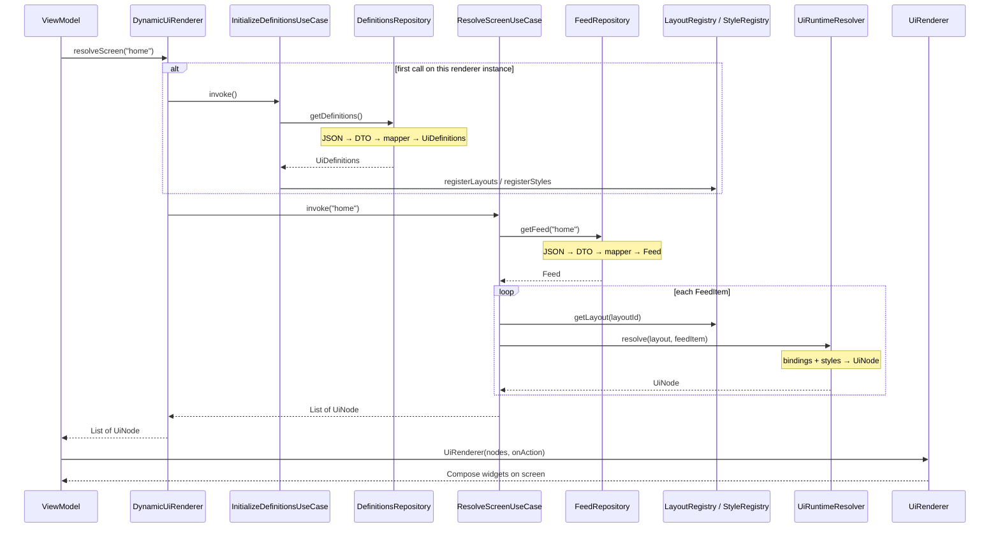
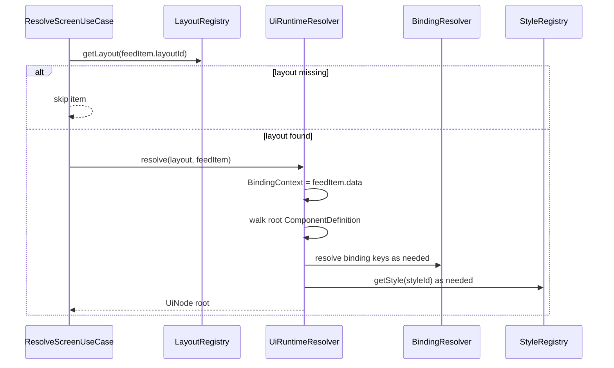
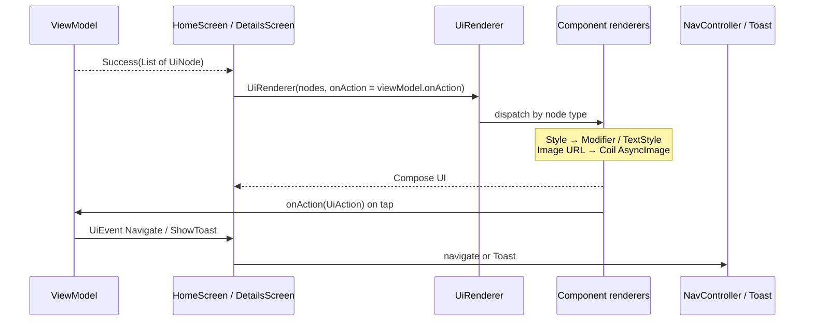
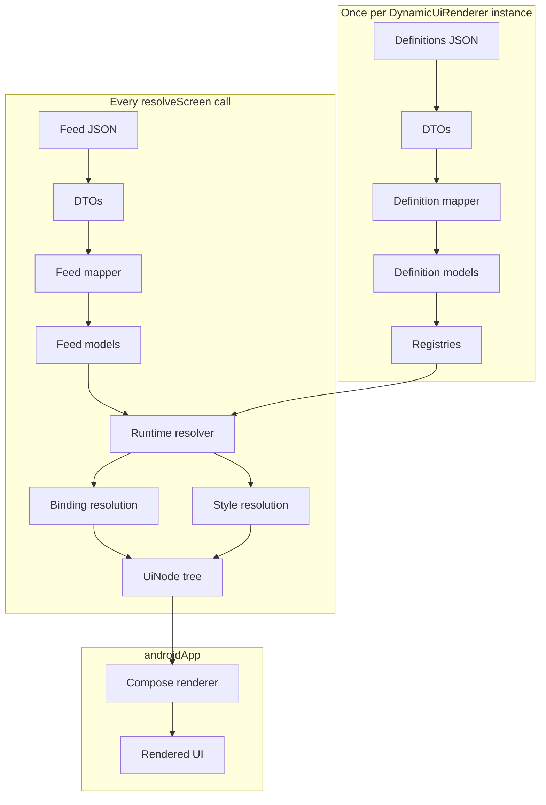

# Rendering Pipeline

Step-by-step path from backend JSON to pixels on screen.

Every screen follows the same pipeline. The ViewModel calls one method; everything below is orchestration inside `shared`, then Compose mapping in `androidApp`.

```text
JSON
  ↓
DTO
  ↓
Definition / Feed Mapper
  ↓
Definition Models  (+ Feed domain models)
  ↓
Runtime Resolver
  ↓
Binding Resolution
  ↓
Style Resolution
  ↓
UiNode Tree
  ↓
Compose Renderer
  ↓
Rendered UI
```

---

## End-to-End Sequence

A screen such as Home starts with `DynamicUiRenderer.resolveScreen("home")`.



There are **two backend payloads** and therefore **two JSON→model paths**:

| Payload | When | Outcome |
|---------|------|---------|
| UI definitions | Once per renderer (lazy) | Layouts + styles cached in registries |
| Feed for `screenId` | Every `resolveScreen` call | Content used to resolve trees |

---

## 1. JSON

Remote HTTP responses are plain JSON.

| Request | Example path |
|---------|----------------|
| Definitions | `GET http://10.0.2.2:3000/mock/dynui/ui-definitions` |
| Feed | `GET http://10.0.2.2:3000/mock/dynui/feed/{screenId}` |

**Transformation at this stage:** bytes on the wire → structured JSON documents.

Polymorphic objects (components, actions) are identified by a `"type"` field. Unknown keys are ignored by the client serializer.

---

## 2. DTO

Ktor + kotlinx.serialization deserialize JSON into **DTO types** in the data layer.

| JSON root | DTO root |
|-----------|----------|
| Definitions body | `UiDefinitionsDto` (`layouts`, `styles`) |
| Feed body | `FeedDto` (`items`) |

Component JSON becomes a sealed DTO hierarchy (`TextDefinitionDto`, `ImageDefinitionDto`, `StackDefinitionDto`, `CardDefinitionDto`, `ListDefinitionDto`). Actions become `NavigateActionDto` / `ToastActionDto`.

**Transformation:** JSON values → Kotlin data classes with **primitives only** (`String`, `Int`, `JsonElement` maps). No `LayoutId`, no `Style`, no Compose types.

DTOs exist so serialization shape can change without forcing domain or runtime types to match the wire format 1:1.

---

## 3. Definition Mapper (and Feed Mapper)

Repositories never return DTOs to use cases. They map immediately:

```text
DefinitionsApi → UiDefinitionsDto → UiDefinitionsMapper → UiDefinitions
FeedApi        → FeedDto          → FeedMapper          → Feed
```

### Definitions mapping

| From (DTO) | To (domain / definition) |
|------------|---------------------------|
| Layout `id: String` | `LayoutId` + `LayoutDefinition` |
| Component tree | `ComponentDefinition` sealed types |
| `styleId: String?` | `StyleId?` (still unresolved) |
| `binding: String?` | `BindingKey?` (still unresolved) |
| Style fields as strings/ints | Parsed `Style` object |
| Action DTO | `NavigateAction` / `ToastAction` |

Style string fields are parsed by `StyleValueMapper`:

| Wire value | Domain type |
|------------|-------------|
| `"fill"` / `"wrap"` / `"120"` | `Dimension` |
| `"8,8,8,8"` | `EdgeInsets` or `CornerRadius` |
| `"bold"` | `FontWeight` |
| `"start"` | `Alignment` |

Orientation: only `"horizontal"` (case-insensitive) becomes `HORIZONTAL`; everything else becomes `VERTICAL`.

### Feed mapping

| From (DTO) | To (domain) |
|------------|-------------|
| Item `id` | `ComponentId` |
| `layoutId` | `LayoutId` |
| `data` map | `Map<BindingKey, UiValue>` |
| Nested JSON | `StringValue` / `NumberValue` / `BooleanValue` / `ObjectValue` / `ListValue` / `NullValue` |
| Item `action` | Domain `UiAction?` |

**List rule:** JSON arrays become `ListValue` of **objects only**; non-object elements are dropped.

**Transformation:** wire-friendly DTOs → typed domain/definition models suitable for registries and resolution.

---

## 4. Definition Models

After mapping definitions, the system holds:

| Model | Meaning |
|-------|---------|
| `UiDefinitions` | Maps of `LayoutId → LayoutDefinition` and `StyleId → Style` |
| `LayoutDefinition` | One template: id + root `ComponentDefinition` |
| `ComponentDefinition` | Unresolved tree (`TextDefinition`, `ImageDefinition`, …) |
| `Style` | Already-parsed visual properties (but still keyed by id in the registry) |

**Important:** component definitions still carry **`styleId`** and **`binding`**, not final text/URL/style objects on every leaf. They describe *how to build* UI once data arrives.

`InitializeDefinitionsUseCase` then **registers** those maps into in-memory registries. Later screen resolves read from registries; they do not re-parse definition JSON.

---

## 5. Runtime Resolver

For each feed item, `ResolveScreenUseCase`:

1. Looks up `layoutRegistry.getLayout(feedItem.layoutId)`.
2. If missing → item is **skipped** (`mapNotNull`).
3. If found → `UiRuntimeResolver.resolve(layout, feedItem)`.



**Transformation:** one **template** + one **feed item** → one **root `UiNode`**. Children are produced recursively. Lists expand into multiple item trees (see binding).

The resolver is pure against registries + feed data: no network.

---

## 6. Binding Resolution

Bindings connect template placeholders to feed data.

```text
BindingKey  +  BindingContext(data)  →  UiValue?
```

`BindingResolver` performs a **flat map lookup**: `context.data[binding]`. There is no dotted path traversal.

### Text / Image

Priority:

1. Static field on the definition (`text` / `url`) if present  
2. Else binding lookup → `.asString()`  
3. Else `""`

### List

1. Resolve the list’s required `binding` to a `UiValue`.
2. Cast to `ListValue` (otherwise treat as empty list).
3. For each `ObjectValue` in the list:
   - Build a **new** `BindingContext` from that object’s map.
   - Resolve the list’s **children** as an item template under that context.
4. Emit `ListNode.items` as `List<List<UiNode>>` (one inner list per row).

**Transformation:** unresolved `binding` keys → concrete strings (leaves) or repeated child trees (lists).

---

## 7. Style Resolution

Definitions reference styles by id. Nodes receive the **resolved `Style` object**.

```text
StyleId?  →  StyleRegistry.getStyle(id)  →  Style?
```

| Case | Result on node |
|------|----------------|
| `styleId == null` | `style = null` |
| id not in registry | `style = null` |
| id found | full `Style` copied onto the node |

Styles were already converted from DTO strings into domain `Style` during definition mapping; resolution is a **registry lookup**, not a second parse.

**Transformation:** `styleId` reference → optional concrete `Style` on each `UiNode`.

Actions are **not** “resolved” further: definition/feed actions are passed through onto nodes as domain `UiAction` values for Android to execute later.

---

## 8. UiNode Tree

The output of shared for one feed item is a sealed `UiNode` tree.

| Definition | Runtime node | Resolved payload |
|------------|--------------|------------------|
| `TextDefinition` | `TextNode` | `text: String` |
| `ImageDefinition` | `ImageNode` | `url: String` |
| `StackDefinition` | `StackNode` | `orientation` + `children` |
| `CardDefinition` | `CardNode` | `children` |
| `ListDefinition` | `ListNode` | `orientation` + `items` |

Every node also carries:

- `id: ComponentId`
- `style: Style?`
- `action: UiAction?`

**Transformation:** unresolved templates + content → **display-ready trees** with no leftover binding keys or style ids on content fields.

`resolveScreen` returns `List<UiNode>` — one root per successfully resolved feed item.

Example shape:

```text
CardNode
├── TextNode   text = "Charizard"
└── ImageNode  url  = "https://…/6.png"
```

---

## 9. Compose Renderer

Android presentation never re-runs the shared pipeline. It consumes the tree:

```text
ViewModel: List<UiNode>
    → UiRenderer(nodes, onAction)
        → when (node) { TextNode → TextRenderer … }
```



| Node | Compose mapping (conceptually) |
|------|--------------------------------|
| `StackNode` | `Column` or `Row` by orientation; recurse children |
| `CardNode` | Material `Card`; recurse children |
| `TextNode` | Material `Text` + text style mappers |
| `ImageNode` | Coil `AsyncImage` |
| `ListNode` | `LazyColumn` / `LazyRow`; each item is a list of nodes |

Style → Modifier / typography happens only here (shared has no Compose).

**Transformation:** platform-agnostic nodes → Jetpack Compose widgets.

---

## 10. Rendered UI

The user sees native Compose UI driven entirely by the resolved tree:

1. Loading state while `resolveScreen` runs.  
2. Success → dynamic layout from nodes.  
3. Error → message if the call fails.  
4. Taps with actions → navigation or toast via ViewModel events.

No screen hard-codes the card/text/image structure for feed content; structure came from definitions, values from feed, drawing from `UiRenderer`.

---

## Transformation Summary

| Step | Input | Output | What changes |
|------|-------|--------|--------------|
| **JSON** | HTTP body | JSON document | Transport |
| **DTO** | JSON | Primitive DTOs | Deserialization |
| **Mapper** | DTOs | Definitions / Feed / Style / UiValue | Typing + parsing |
| **Definition models** | Mapped definitions | Registries | Cached templates |
| **Runtime resolver** | Layout + FeedItem | Node construction walk | Structure instantiation |
| **Binding resolution** | Keys + context | Concrete values / list rows | Data fill-in |
| **Style resolution** | StyleId | Style object | Visual props attach |
| **UiNode tree** | Walk result | `List<UiNode>` | Host contract |
| **Compose renderer** | UiNode | Composables | Platform drawing |
| **Rendered UI** | Composables | Pixels + side effects | User-visible result |

---

## Phase Boundaries



---

## Mental Model

- **JSON / DTO / Mapper** — get remote shape into typed Kotlin safely.  
- **Definition models + registries** — remember reusable templates.  
- **Runtime + binding + style** — stamp a template with this screen’s data.  
- **UiNode** — the only structure Android needs.  
- **Compose renderer** — draw and handle taps.

If a step fails early (network, bad JSON, unknown layout id), either the whole `resolveScreen` call errors (propagated to the ViewModel) or individual feed items are omitted when their layout is missing.

---

*Related: [architecture.md](./architecture.md) · [README.md](../README.md)*
