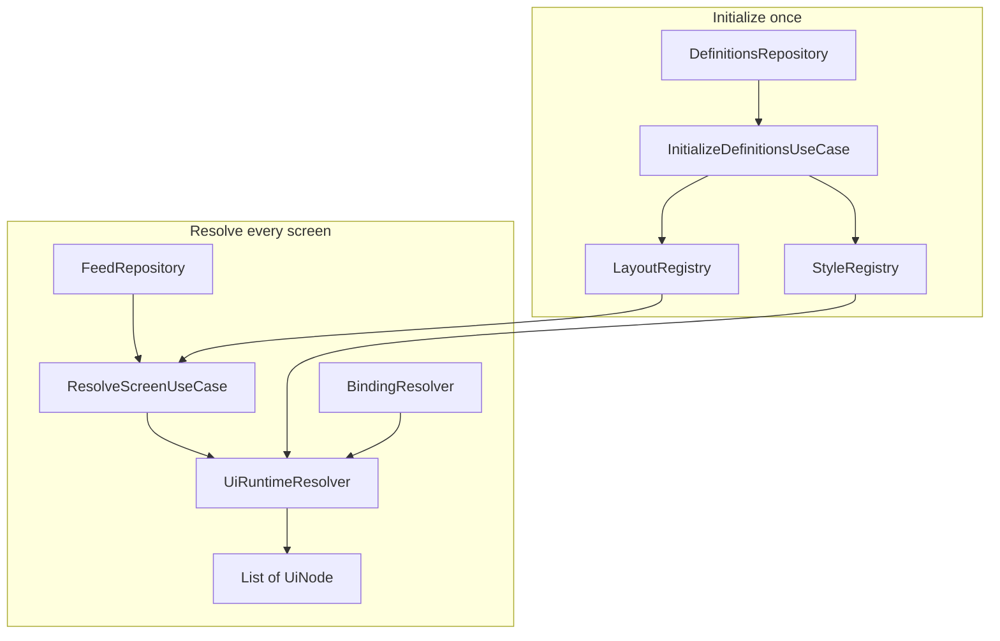
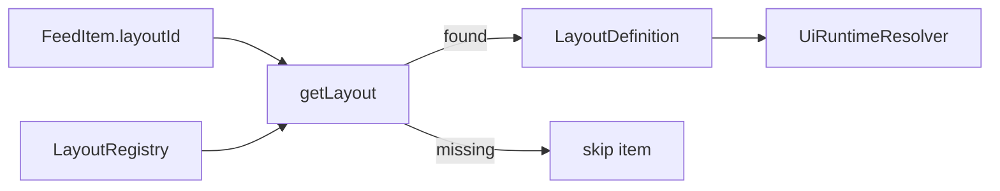
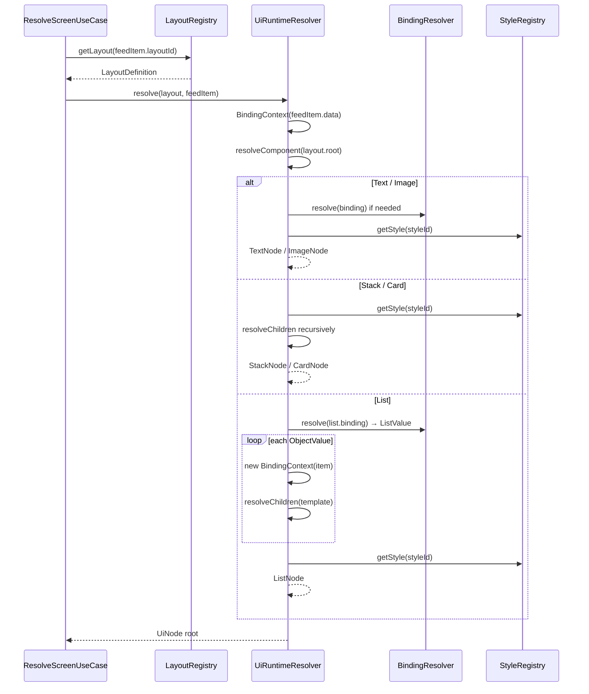
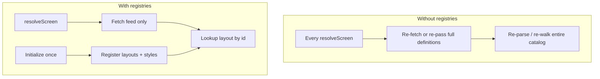
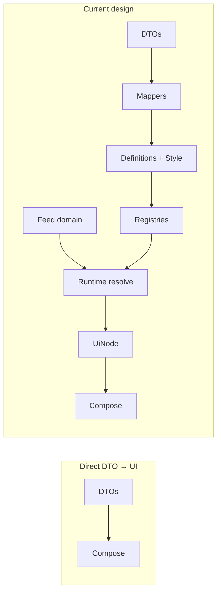
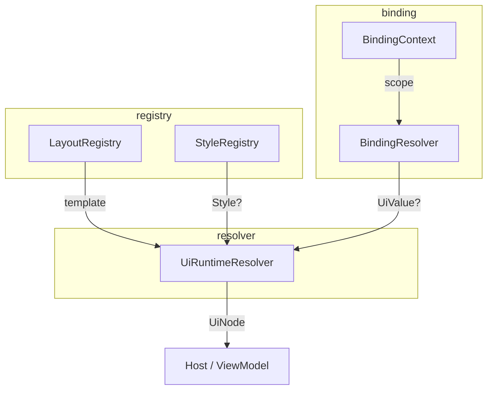

# Runtime

The `runtime` package is the engine that turns **cached templates** and **per-screen feed data** into a resolved `UiNode` tree.

It does not fetch HTTP, deserialize JSON, or draw Compose. It only:

1. Holds layouts and styles in memory  
2. Looks up binding values in a context  
3. Walks definition trees into runtime nodes  

```text
shared/runtime/
├── registry/     LayoutRegistry · StyleRegistry
├── binding/      BindingContext · BindingResolver
├── resolver/     UiRuntimeResolver
└── state/        InitializationState (internal to bootstrap)
```

---

## Where Runtime Sits



Use cases orchestrate; **runtime** owns the caches and the resolve algorithm.

---

## LayoutRegistry

In-memory store of layout templates keyed by `LayoutId`.

```kotlin
interface LayoutRegistry {
    fun registerLayouts(layouts: Map<LayoutId, LayoutDefinition>)
    fun getLayout(layoutId: LayoutId): LayoutDefinition?
    fun clear()
}
```

**Behavior (`LayoutRegistryImpl`):**

- `registerLayouts` **clears** then replaces the map (full snapshot, not merge).
- `getLayout` returns the template or `null`.
- Used by `ResolveScreenUseCase`: unknown `layoutId` → that feed item is **skipped**.



Layouts are **unresolved** trees (`ComponentDefinition` with `styleId` / `binding`). The registry does not resolve them; it only stores and returns them.

---

## StyleRegistry

In-memory store of parsed styles keyed by `StyleId`.

```kotlin
interface StyleRegistry {
    fun registerStyles(styles: Map<StyleId, Style>)
    fun getStyle(styleId: StyleId): Style?
    fun clear()
}
```

**Behavior (`StyleRegistryImpl`):** same replace-on-register pattern as layouts.

During resolve, `UiRuntimeResolver` calls `getStyle(styleId)` for each component that references a style. Missing id → `node.style = null`.

Styles in the registry are already **domain `Style` objects** (dimensions, insets, enums). Registration happens after DTO mapping, not with raw JSON strings.

---

## BindingResolver

Looks up a `BindingKey` inside the current `BindingContext`.

```kotlin
interface BindingResolver {
    fun resolve(
        binding: BindingKey?,
        context: BindingContext
    ): UiValue?
}
```

Implementation is a flat map get (`context.data[binding]`). Null binding or missing key → `null`.

The runtime resolver uses this for:

- Text / image content when no static value is set  
- List data (`ListValue`) when expanding item templates  

Contexts are swapped for nested list items; the resolver itself never walks paths. See [bindings.md](./bindings.md).

---

## UiRuntimeResolver

The core walk: **layout template + feed item → one `UiNode` root**.

```kotlin
interface UiRuntimeResolver {
    fun resolve(
        layout: LayoutDefinition,
        feedItem: FeedItem
    ): UiNode
}
```

### Algorithm



| Definition | Produces |
|------------|----------|
| `TextDefinition` | `TextNode` with concrete `text` |
| `ImageDefinition` | `ImageNode` with concrete `url` |
| `StackDefinition` | `StackNode` + resolved children |
| `CardDefinition` | `CardNode` + resolved children |
| `ListDefinition` | `ListNode` with `items: List<List<UiNode>>` |

Actions on definitions are **passed through** onto nodes. Styles and bindings are **filled in**. No network access inside the resolver.

---

## Why Registries Are Used

Definitions and feed have different lifetimes and shapes.

| Concern | Definitions | Feed |
|---------|-------------|------|
| Change frequency | Rare (templates / design system) | Per screen / per visit |
| Size | Shared across screens | Screen-specific |
| Role | Structure + style catalog | Content + which layout to use |



**Reasons registries exist:**

1. **Reuse** — One `pokemon_card_layout` serves many feed items and screens.  
2. **Cost** — Parse and type styles/layouts once; resolve only reads maps.  
3. **Decoupling** — Feed carries a `layoutId` string (as `LayoutId`), not an inline copy of the whole tree.  
4. **Clear boundary** — Initialization *writes* registries; screen resolve *reads* them.  
5. **Replaceable cache** — `register*` clears and replaces; a future refresh can reload definitions without changing the resolver API.

Registries are the runtime’s answer to “templates are infrastructure, not request payload.”

---

## Why Resolve at Runtime (Not Directly from DTOs)

It can be tempting to map JSON DTOs straight into Compose-ready structures. This project deliberately inserts **domain definitions + runtime resolve** in between.



### 1. DTOs are a serialization detail

DTOs use primitives and wire conventions (`"padding": "8,8,8,8"`, `"type": "text"`). UI hosts should not depend on kotlinx.serialization shapes or JSON quirks. Mapping once into definitions/`Style` isolates the wire format.

### 2. Templates are incomplete without data

A `TextDefinition` may only have `binding: "name"`. There is no final string until a **specific** `FeedItem` (or list item context) is applied. Resolving “from DTOs alone” cannot produce a finished tree for a screen.

### 3. One template, many instances

Runtime resolve stamps the same layout onto each feed item (and each list row). DTO→UI in one shot would either duplicate templates per item on the server or push that expansion into Android.

### 4. Style ids vs style objects

Components reference `styleId`. The resolved node needs a `Style` instance. Lookup belongs at resolve time against a registry, not inside every DTO field as an inlined copy (which would bloat JSON and drift from the catalog).

### 5. Platform-agnostic output

Runtime emits `UiNode`, not Compose. Android (or another host) maps nodes to widgets. Resolving from DTOs “directly” usually means baking in a UI toolkit early and losing that split.

### 6. Skip and fail policies live in one place

Unknown layout → skip item. Missing style → `null` style. Missing binding → empty text/URL or empty list. Those rules sit in use case + resolver, not scattered across deserializers and Composables.

**Summary:** DTOs get you *into* the domain. Registries hold *reusable* structure. Runtime resolve produces *instance* UI trees for *this* feed. Compose only paints the result.

---

## Package Collaboration



| Piece | Writes | Reads |
|-------|--------|-------|
| `LayoutRegistry` | Init use case | Resolve use case |
| `StyleRegistry` | Init use case | `UiRuntimeResolver` |
| `BindingResolver` | — | `UiRuntimeResolver` |
| `UiRuntimeResolver` | — | registries + bindings; outputs nodes |

---

## Mental Model

- **Registries** = cookbook (recipes and style tokens)  
- **Feed** = today’s order (which recipe + what ingredients)  
- **BindingResolver** = read an ingredient from the current bowl  
- **UiRuntimeResolver** = cook one dish (one `UiNode` tree)  

Android never opens the cookbook itself — it only receives the finished dish.

---

*Related: [rendering_pipeline.md](./rendering_pipeline.md) · [bindings.md](./bindings.md) · [styles.md](./styles.md) · [architecture.md](./architecture.md)*
