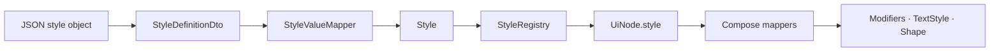
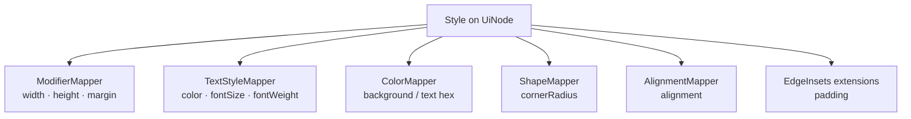
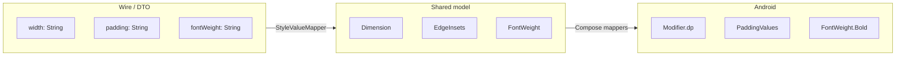

# Styles

How visual properties move from backend JSON to Compose.

Styles are defined once in `/ui-definitions`, cached in `StyleRegistry`, attached to nodes at resolve time as a concrete `Style` object, then mapped to Modifiers / text styles / shapes in `androidApp`.

```text
StyleDefinitionDto
  ↓
StyleValueMapper   (+ UiDefinitionsMapper.mapStyle)
  ↓
Style
  ↓
Compose mappers    (ModifierMapper, TextStyleMapper, …)
  ↓
Rendered look
```

---

## Pipeline Overview



| Stage | Module | Job |
|-------|--------|-----|
| `StyleDefinitionDto` | shared / data | Mirror wire format (mostly strings) |
| `StyleValueMapper` | shared / data | Parse strings into typed style values |
| `Style` | shared / model | Platform-agnostic resolved style |
| Compose mappers | androidApp | Turn `Style` into Compose APIs |

Components never embed full style objects in JSON. They reference a style by id (`"styleId": "card_title"`). The runtime resolver looks up that id and sets `node.style`.

---

## StyleDefinitionDto

Wire-level style entry from the definitions payload.

```kotlin
@Serializable
data class StyleDefinitionDto(
    val id: String,
    val width: String? = null,
    val height: String? = null,
    val padding: String? = null,
    val margin: String? = null,
    val spacing: Int? = null,
    val backgroundColor: String? = null,
    val textColor: String? = null,
    val fontSize: Int? = null,
    val fontWeight: String? = null,
    val cornerRadius: String? = null,
    val alignment: String? = null
)
```

### JSON example

```json
{
  "id": "card_title",
  "width": "fill",
  "height": "wrap",
  "padding": "8,12,8,12",
  "margin": "0,0,8,0",
  "spacing": 8,
  "backgroundColor": "#FFFFFF",
  "textColor": "#212121",
  "fontSize": 18,
  "fontWeight": "bold",
  "cornerRadius": "12,12,12,12",
  "alignment": "start"
}
```

| Field | JSON type | Notes |
|-------|-----------|--------|
| `id` | string | Registry key; referenced by components as `styleId` |
| `width` / `height` | string | `"fill"`, `"wrap"`, or integer dp as string |
| `padding` / `margin` | string | Exactly four comma-separated ints |
| `spacing` | int | Gap hint for containers (dp) |
| `backgroundColor` / `textColor` | string | CSS-like color strings |
| `fontSize` | int | Size in sp (interpreted on Android) |
| `fontWeight` | string | See FontWeight section |
| `cornerRadius` | string | Four comma-separated ints |
| `alignment` | string | `"start"` \| `"center"` \| `"end"` |

DTOs stay stringly where parsing rules are non-trivial. That keeps deserialization simple and pushes validation into one mapper.

---

## StyleValueMapper

Internal parser used when mapping definitions:

```text
StyleDefinitionDto  →  StyleValueMapper  →  fields on Style
```

```kotlin
// Conceptual — from UiDefinitionsMapperImpl.mapStyle
Style(
    width = StyleValueMapper.toDimension(dto.width),
    height = StyleValueMapper.toDimension(dto.height),
    padding = StyleValueMapper.toEdgeInsets(dto.padding),
    margin = StyleValueMapper.toEdgeInsets(dto.margin),
    spacing = dto.spacing,
    backgroundColor = dto.backgroundColor,
    textColor = dto.textColor,
    fontSize = dto.fontSize,
    fontWeight = StyleValueMapper.toFontWeight(dto.fontWeight),
    cornerRadius = StyleValueMapper.toCornerRadius(dto.cornerRadius),
    alignment = StyleValueMapper.toAlignment(dto.alignment),
)
```

**Missing / blank strings** → `null` (property omitted).  
**Invalid tokens** (bad dimension, wrong arity for insets, unknown weight) → `IllegalArgumentException` at map time.

Colors and `spacing` / `fontSize` pass through without `StyleValueMapper` (already usable types on the DTO).

---

## Style

Resolved, shared model attached to `UiNode`:

```kotlin
data class Style(
    val width: Dimension? = null,
    val height: Dimension? = null,
    val margin: EdgeInsets? = null,
    val padding: EdgeInsets? = null,
    val spacing: Int? = null,
    val backgroundColor: String? = null,
    val textColor: String? = null,
    val fontSize: Int? = null,
    val fontWeight: FontWeight? = null,
    val cornerRadius: CornerRadius? = null,
    val alignment: Alignment? = null
)
```

After initialization, styles live in `StyleRegistry` as `Map<StyleId, Style>`. Resolve time does **not** re-parse JSON — it only looks up by `StyleId`.

---

## Typed Style Building Blocks

### Dimension

```kotlin
sealed interface Dimension {
    data object Fill : Dimension
    data object Wrap : Dimension
    data class Fixed(val value: Int) : Dimension
}
```

| JSON | Domain |
|------|--------|
| `"fill"` | `Dimension.Fill` |
| `"wrap"` | `Dimension.Wrap` |
| `"120"` | `Dimension.Fixed(120)` |
| omitted / `""` | `null` |

Compose mapping (`ModifierMapper`):

| Dimension | Width | Height |
|-----------|-------|--------|
| `Fill` | `fillMaxWidth()` | `fillMaxHeight()` |
| `Wrap` | `wrapContentWidth()` | `wrapContentHeight()` |
| `Fixed(n)` | `width(n.dp)` | `height(n.dp)` |

```json
{ "id": "hero_image", "width": "fill", "height": "200" }
```

---

### EdgeInsets

```kotlin
data class EdgeInsets(
    val top: Int,
    val right: Int,
    val bottom: Int,
    val left: Int
)
```

JSON uses a **single string** of four integers:

```text
"top,right,bottom,left"
```

```json
{ "padding": "16,16,16,16", "margin": "0,0,8,0" }
```

Rules:

- Exactly **four** comma-separated values  
- Each value must parse as `Int`  
- Blank / null → `null` insets  

On Android, insets become `PaddingValues` (start = left, end = right). `ModifierMapper` applies **margin** as outer padding; component renderers also use `Modifier.padding(edgeInsets)` for content padding via extensions.

---

### CornerRadius

```kotlin
data class CornerRadius(
    val topStart: Int,
    val topEnd: Int,
    val bottomEnd: Int,
    val bottomStart: Int
)
```

Same four-value string format as insets:

```text
"topStart,topEnd,bottomEnd,bottomStart"
```

```json
{ "cornerRadius": "12,12,0,0" }
```

Compose (`ShapeMapper`):

- `null` → `RectangleShape`  
- otherwise → `RoundedCornerShape(...dp)` per corner  

---

### Alignment

```kotlin
enum class Alignment {
    START,
    CENTER,
    END
}
```

| JSON | Enum |
|------|------|
| `"start"` | `START` |
| `"center"` | `CENTER` |
| `"end"` | `END` |

```json
{ "alignment": "center" }
```

Compose (`AlignmentMapper`):

| Shared | Horizontal | Vertical |
|--------|------------|----------|
| `START` | `Alignment.Start` | `Alignment.Top` |
| `CENTER` | `CenterHorizontally` | `CenterVertically` |
| `END` | `Alignment.End` | `Alignment.Bottom` |
| `null` | Start / Top defaults | |

Used by container renderers when arranging children.

---

### FontWeight

```kotlin
enum class FontWeight {
    THIN, EXTRA_LIGHT, LIGHT, NORMAL, MEDIUM,
    SEMIBOLD, BOLD, EXTRA_BOLD, BLACK
}
```

**Accepted from JSON today** (`StyleValueMapper.toFontWeight`):

| JSON | Enum |
|------|------|
| `"normal"` | `NORMAL` |
| `"medium"` | `MEDIUM` |
| `"semibold"` | `SEMIBOLD` |
| `"bold"` | `BOLD` |

The enum includes finer weights for Compose mapping completeness; those extra values are not produced by the current JSON parser.

```json
{ "fontSize": 18, "fontWeight": "bold", "textColor": "#212121" }
```

Compose (`TextStyleMapper`) maps every enum case to `androidx.compose.ui.text.font.FontWeight` (Thin → Black).

---

## Compose Mappers

Android is the only place `Style` becomes toolkit types.



| Mapper | Input from Style | Compose output |
|--------|------------------|----------------|
| `ModifierMapper` | `width`, `height`, `margin` | `Modifier` chain |
| `TextStyleMapper` | `textColor`, `fontSize`, `fontWeight` | `TextStyle` |
| `ColorMapper` | color strings | `Color?` (invalid → null) |
| `ShapeMapper` | `cornerRadius` | `Shape` |
| `AlignmentMapper` | `alignment` | horizontal / vertical alignment |
| `EdgeInsets` extensions | `padding` | `Modifier.padding` / `PaddingValues` |

Shared never imports Compose. That keeps style meaning portable; only mapping is platform-specific.

---

## Full Definitions Snippet

```json
{
  "layouts": [
    {
      "id": "pokemon_card_layout",
      "root": {
        "type": "card",
        "id": "pokemon_card",
        "styleId": "card_container",
        "children": [
          {
            "type": "text",
            "id": "name",
            "styleId": "card_title",
            "binding": "name"
          },
          {
            "type": "image",
            "id": "sprite",
            "styleId": "card_image",
            "binding": "imageUrl"
          }
        ]
      }
    }
  ],
  "styles": [
    {
      "id": "card_container",
      "width": "fill",
      "backgroundColor": "#FFFFFF",
      "padding": "16,16,16,16",
      "cornerRadius": "12,12,12,12",
      "spacing": 8
    },
    {
      "id": "card_title",
      "width": "fill",
      "textColor": "#212121",
      "fontSize": 18,
      "fontWeight": "bold",
      "padding": "0,0,8,0",
      "alignment": "start"
    },
    {
      "id": "card_image",
      "width": "fill",
      "height": "160",
      "cornerRadius": "8,8,8,8"
    }
  ]
}
```

Flow for `"card_title"`:

1. DTO deserialized with string fields.  
2. `StyleValueMapper` builds `Dimension.Fill`, `FontWeight.BOLD`, `EdgeInsets(0,0,8,0)`, etc.  
3. Stored as `Style` under `StyleId("card_title")`.  
4. Text node resolve copies that `Style` onto `TextNode`.  
5. `TextStyleMapper` + padding helpers apply it in Compose.

---

## Why Styles Are Strongly Typed

Leaving everything as `String` through the stack would push parsing into every renderer and every future platform host.

| Decision | Benefit |
|----------|---------|
| **Parse once in shared** | Invalid `"widt"` / `"8,8"` fails at definition load, not while drawing |
| **`Dimension` sealed type** | Exhaustive `when` in Compose — Fill / Wrap / Fixed cannot be confused |
| **`EdgeInsets` / `CornerRadius` structs** | Four sides are explicit; no “which index is left?” at UI time |
| **`Alignment` / `FontWeight` enums** | Closed sets; mappers stay small and refactor-safe |
| **`Style` on the node** | Android never sees `styleId` or raw JSON tokens |
| **Colors still `String?` in `Style`** | Parsing to `Color` is Android-specific (`toColorInt`); shared stays toolkit-free |

Strong typing is the boundary between **authoring format** (flexible strings in JSON) and **runtime contract** (checked domain values). `StyleValueMapper` is that boundary.



---

## Mental Model

1. **DTO** — what the backend can send.  
2. **StyleValueMapper** — validate and parse into domain types.  
3. **Style** — what nodes carry after resolve.  
4. **Compose mappers** — what pixels and typography become on Android.

Reuse styles by id across many components; change look in definitions without changing layouts or feed data.

---

*Related: [rendering_pipeline.md](./rendering_pipeline.md) · [architecture.md](./architecture.md) · [bindings.md](./bindings.md)*
